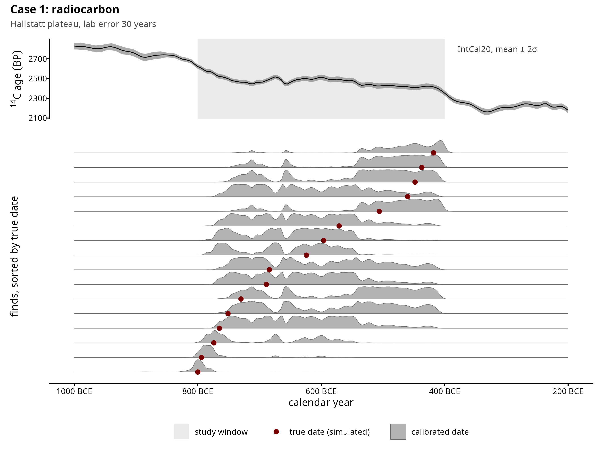
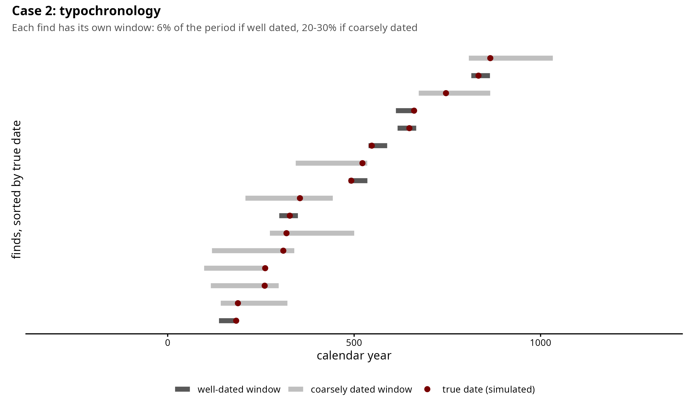
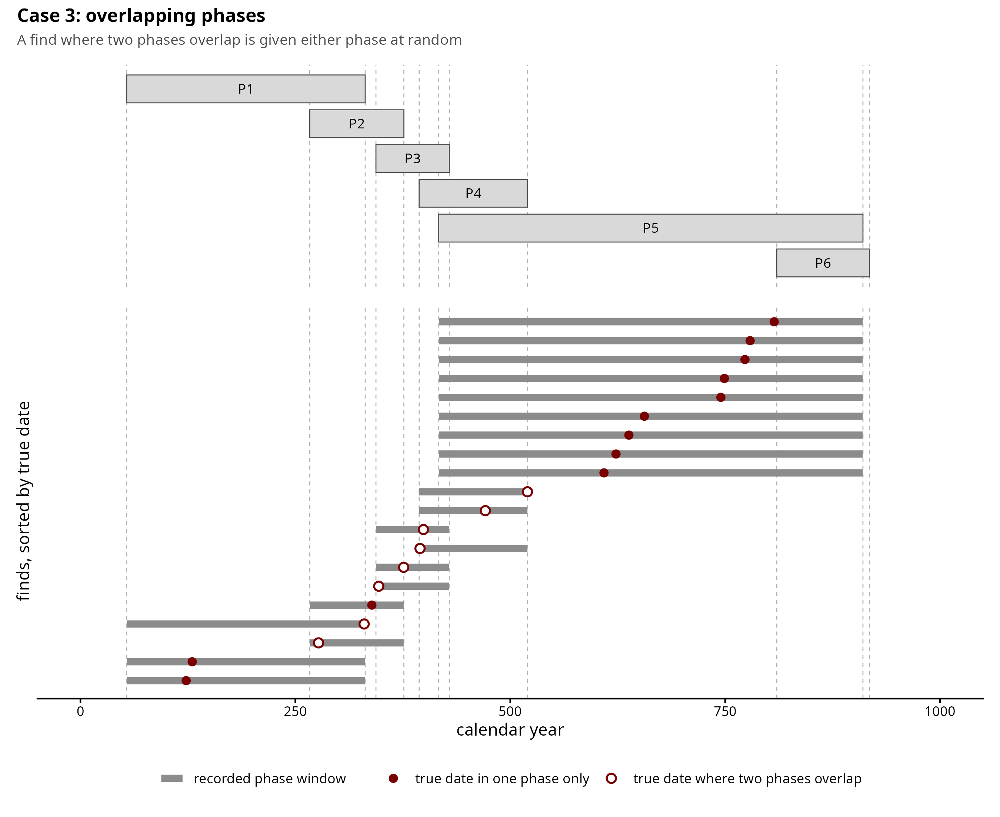
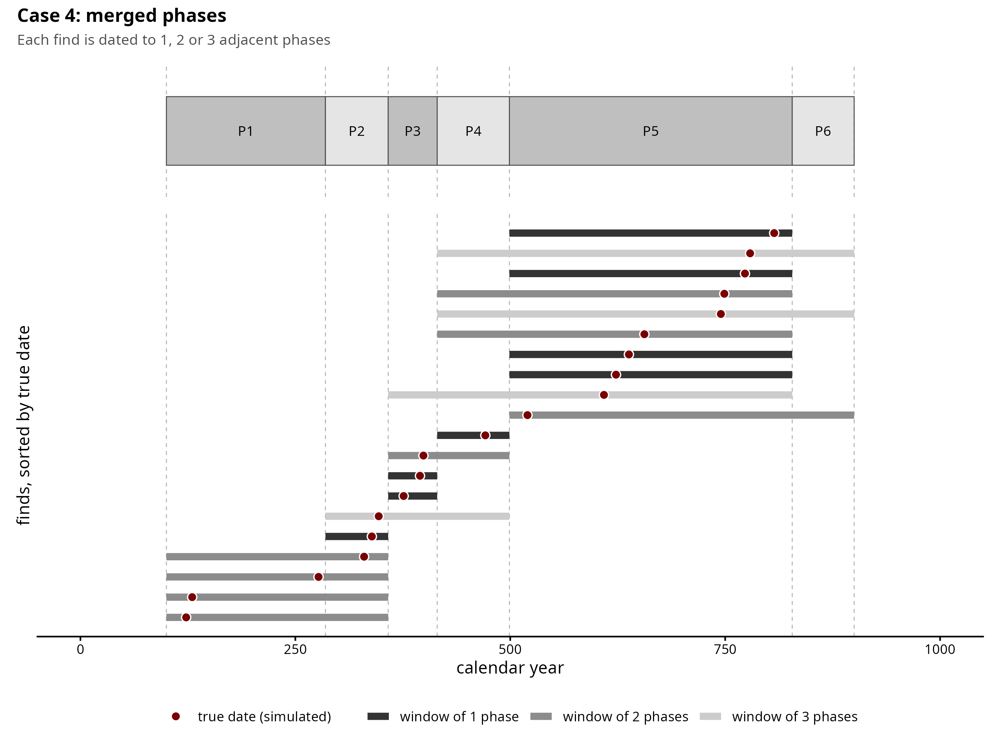

# BTChron Continuous Variable

> [!NOTE]  
> Work in progress for the [first BTChron paper](). This readme will be updated soon with more details.

> [!IMPORTANT]
> Note to self (RR): make some comments shorter and more elegant.

## Simulation cases

Each case simulates finds with a known date and a measured value that follows a
linear trend, then records the date the way a real dataset would. The figures
show only the dating step: one row per find, sorted by true date.

**Case 1: radiocarbon.** Each find has a ¹⁴C measurement, calibrated against
IntCal20. On the Hallstatt plateau (800–400 BCE) a flat stretch of the curve
spreads each date across most of the window.



**Case 2: typochronology.** Each find has its own date range, independent of the
others: short if the find is well dated, long if it is coarsely dated.



**Case 3: overlapping phases.** All finds share one phase scheme whose phases
overlap at their edges. A find from an overlap is assigned to either phase at
random.



**Case 4: merged phases.** Finds are dated on one phase scheme at different
levels of detail: to a single phase, or only to a broader period made of two or
three adjacent phases.



## Repository structure

```
BTChron_Paper_1/
├── Simulations/
│   ├── shared/                        # what all four cases have in common
│   │   ├── models/                    # Stan models: full distribution, midpoint/median, latent date
│   │   ├── scripts/                   # functions every case sources (weight rows, fitting, summaries)
│   │   ├── checks/                    # full distribution vs latent-date equivalence check
│   │   ├── figures/                   # how each case records a date
│   │   └── README.md                  # the shared method, explained once
│   ├── Sim_Case1_Radiocarbon/         # calibrated 14C dates: Hallstatt plateau vs steep section
│   ├── Sim_Case2_Typochronology/      # independent typological windows ("first half of the 1st c. CE")
│   ├── Sim_Case3_OverlappingPhases/   # ceramic phases that overlap at their edges
│   ├── Sim_Case4_MergedPhases/        # finds dated to a broad period spanning several phases
│   └── Sim_Sweep_Ratio/               # side study: dating uncertainty relative to the spread of the material
└── Real_Data/
    ├── dataset_1/                     # linear case study (GINI database)
    ├── dataset_2/                     # not yet started
    └── dataset_3/                     # not yet started
```

Every simulation case has the same layout:

```
Sim_CaseN_<name>/
├── README.md                # the dating problem, the result, what each file does
├── data/design.csv          # every simulated dataset: its settings and its seed
├── scripts/
│   ├── simulate.R           # generates one dataset
│   ├── 01_design.R          # builds data/design.csv
│   ├── 03_recovery_study.R  # fits every model to every dataset (slow)
│   ├── 04_recovery_plots.R  # tables and figures from the fits
│   ├── 05_single_fit.R      # one dataset, fitted and shown up close
│   └── checks/              # tests that the generator does what it claims
└── figures/
    ├── dataset_anatomy.png          # what the data looks like before fitting
    ├── single_fit_comparison.png    # one fit, midpoint vs full distribution
    ├── recovery_summary.png         # the headline result
    ├── recovery_by_<factor>.png     # the result as dating gets coarser
    └── checks/                      # secondary sweeps and generator checks
```

Case 1 also has `02_figures.R` (the calibrated-date overview) and `scripts/diagnostics/`
(side investigations). Model fits are written to `output/`, which is not tracked.

## Models compared

| Figures | Code | What the date becomes |
|---|---|---|
| Midpoint | `midpoint` | one year: the middle of the window or HPD envelope |
| Calibrated median | `median` | one year: the median of the calibrated distribution (Case 1 only) |
| Full distribution | `marginal` | the whole dating distribution, on a 5-year grid |

## Running a case

From the repository root, in order:

```
Rscript Simulations/Sim_Case4_MergedPhases/scripts/01_design.R
Rscript Simulations/Sim_Case4_MergedPhases/scripts/03_recovery_study.R
Rscript Simulations/Sim_Case4_MergedPhases/scripts/04_recovery_plots.R
Rscript Simulations/Sim_Case4_MergedPhases/scripts/05_single_fit.R
```

Case 4 is the shortest and the easiest to read first.
