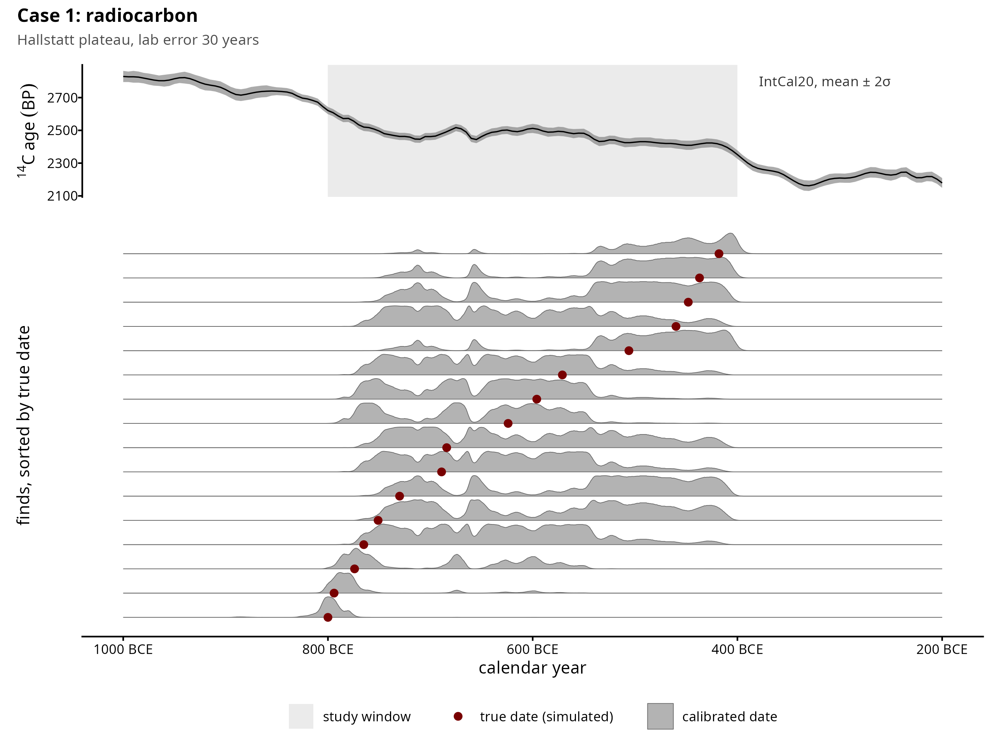
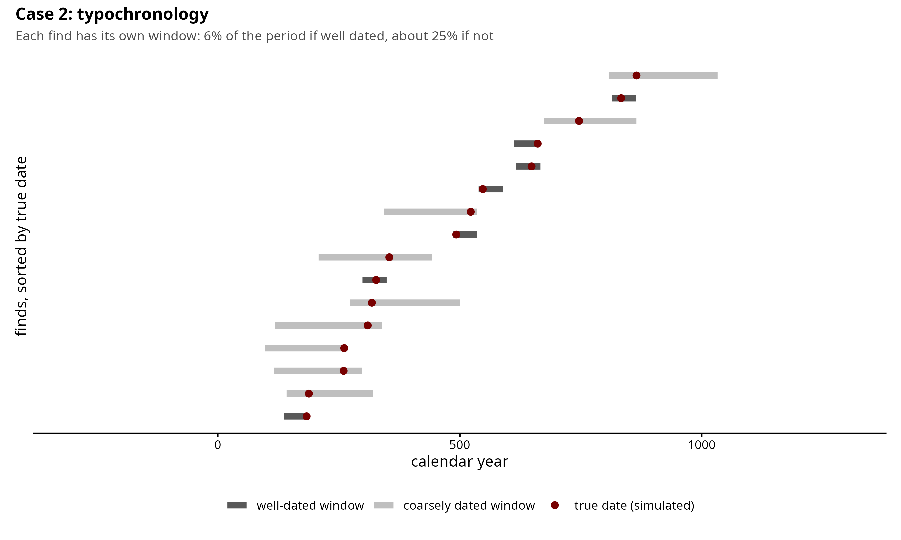
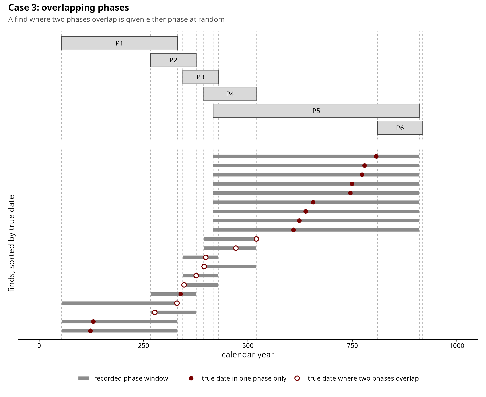
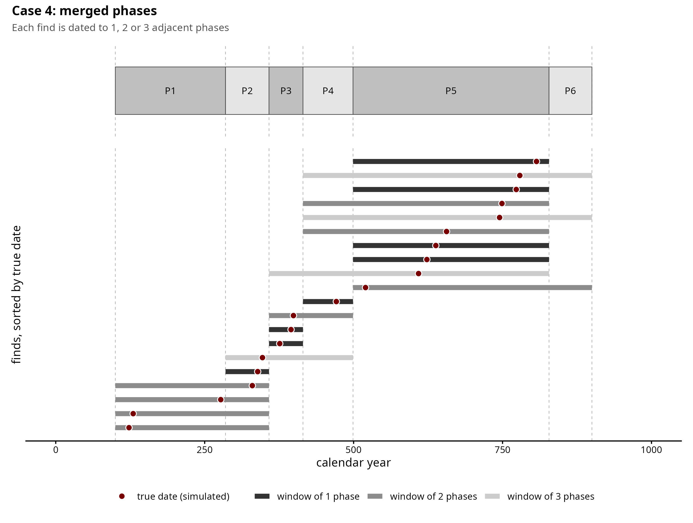

# BTChron Continuous Variable

> [!NOTE]  
> Work in progress for the [first BTChron paper](). This readme will be updated soon with more details.

> [!IMPORTANT]
> Note to self (RR): make some comments shorter and more elegant.

## Simulation cases

Each case simulates finds with a known date and a measured value that follows a
linear trend, then records the date the way a real dataset would. The figures
show only the dating step: one row per find, sorted by true date.

**Case 1: radiocarbon.** Each find has a ¹⁴C measurement, calibrated against
IntCal20. On the Hallstatt plateau (800–400 BCE) a flat stretch of the curve
spreads each date across most of the window.



**Case 2: typochronology.** Each find has its own date range, independent of the
others: short if the find is well dated, long if it is coarsely dated.



**Case 3: overlapping phases.** All finds share one phase scheme whose phases
overlap at their edges. A find from an overlap is assigned to either phase at
random.



**Case 4: merged phases.** Finds are dated on one phase scheme at different
levels of detail: to a single phase, or only to a broader period made of two or
three adjacent phases.



## Repository structure

The paper looks at time in two roles, and each role is tested on the same four
dating cases:

- **time as predictor**: a measured value changes with the date
  (value = intercept + slope × date)
- **time as response**: the date changes with a measured value known exactly
  (date = intercept + slope × value), as in Crema's measurement_error_example.R

```
BTChron_Paper_1/
├── Simulations/
│   ├── shared/
│   │   ├── models/      # linear_dates.stan (time as predictor), linear_dates_response.stan (time as response)
│   │   ├── dating/      # how each case dates a find: radiocarbon, windows, phases (used by both roles)
│   │   ├── scripts/     # older helpers, still used by checks and diagnostics
│   │   ├── checks/      # full distribution vs latent-date equivalence check
│   │   ├── figures/     # how each case records a date
│   │   └── README.md    # the models and the metrics, explained once
│   ├── time_as_predictor/
│   │   ├── Case1_Radiocarbon/        # calibrated 14C dates: Hallstatt plateau vs steep section
│   │   ├── Case2_Typochronology/     # independent typological windows ("first half of the 1st c. CE")
│   │   ├── Case3_OverlappingPhases/  # ceramic phases that overlap at their edges
│   │   └── Case4_MergedPhases/       # finds dated to a broad period spanning several phases
│   ├── time_as_response/             # the same four cases (in progress)
│   └── archive/                      # earlier simulations, not part of the paper
└── Real_Data/
    ├── dataset_1/                     # linear case study (GINI database)
    ├── dataset_2/                     # not yet started
    └── dataset_3/                     # not yet started
```

Every case folder has the same layout:

```
CaseN_<name>/
├── README.md                # the dating problem, the result, what each file does
├── data/design.csv          # every simulated dataset: its settings and its seed
├── scripts/
│   ├── 01_design.R          # builds data/design.csv
│   ├── 03_recovery_study.R  # fits every method to every dataset (slow)
│   ├── 04_recovery_plots.R  # metrics and figures from the fits
│   ├── 05_single_fit.R      # one dataset, fitted and shown up close
│   └── checks/              # tests that the generator does what it claims
└── figures/
    ├── dataset_anatomy.png          # what the data looks like before fitting
    ├── single_fit_comparison.png    # one dataset, fitted by each model
    ├── recovery_summary.png         # the headline result
    ├── recovery_by_<factor>.png     # the result as dating gets coarser
    └── checks/                      # secondary sweeps and generator checks
```

Case 1 also has `02_figures.R` (the calibrated-date overview) and `scripts/diagnostics/`
(side investigations). Fits are written to `output/`, which is not tracked; older
runs are in `output/archive/`.

## Methods compared

All methods use the same Stan model (`Simulations/shared/models/linear_dates.stan`);
only the dates it is given change.

| Figures | Code | What the date becomes |
|---|---|---|
| Midpoint | `midpoint` | one year: the middle of the window or of the 95% calibrated range |
| Calibrated median | `median` | one year: the median of the calibrated distribution (Case 1 only) |
| Full distribution | `marginal` | the whole dating distribution, on a 5-year grid |

## Running a case

From the repository root, in order:

```
Rscript Simulations/time_as_predictor/Case4_MergedPhases/scripts/01_design.R
Rscript Simulations/time_as_predictor/Case4_MergedPhases/scripts/03_recovery_study.R
Rscript Simulations/time_as_predictor/Case4_MergedPhases/scripts/04_recovery_plots.R
Rscript Simulations/time_as_predictor/Case4_MergedPhases/scripts/05_single_fit.R
```

Case 4 is the shortest and the easiest to read first.
