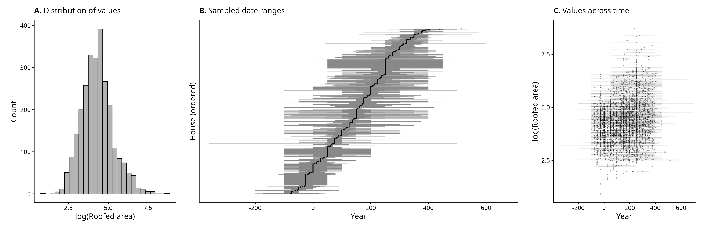
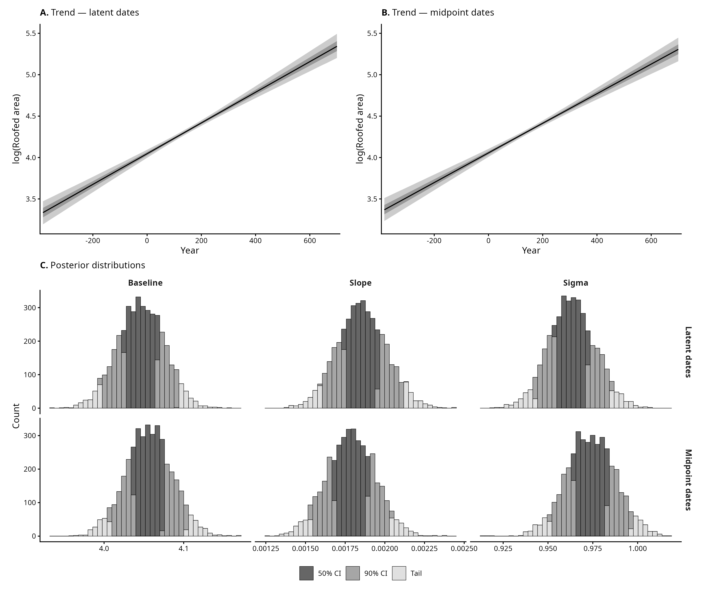
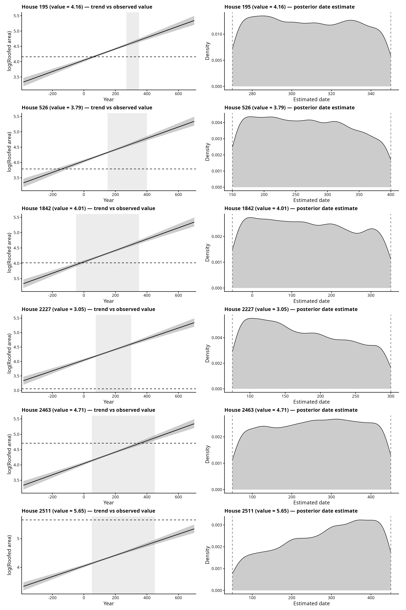

# Real Data

Each `dataset_N` is one case study applying the methods validated in
`Simulations/` to a real archaeological dataset. Raw data and per-dataset fits
live in `data/dataset_N/` and `output/dataset_N/`; the shared `models/`,
`scripts/`, and `figures/` folders hold the code and outputs, with filenames
prefixed by the dataset.

## dataset_1 — Linear case study (GINI database)

The linear model from `Simulations/Sim_Linear`, applied to roofed-area data from
the GINI database (`gini_database_all_records_20240721.csv`). The response is
`log(RoofedArea)`; each house carries a dating window `[BeginHouse, EndHouse]`
rather than a known year. The question is the same as the simulation: does
treating each date as a latent parameter within its window change the inferred
trend, relative to collapsing the window to its midpoint.

Subset: Great Britain, nuclear-family houses, positive roofed area, dated window
(`EndHouse > BeginHouse`), midpoint year in `[-100, 1000]` — **2682 houses**.

### Scripts

| Script | Purpose | Output |
|---|---|---|
| `01_prepare.R` | filter the GINI database, write the subset, exploratory panel | `data/dataset_1/gini_gb_filtered.csv`, `figures/dataset_1_exploratory_panel.png` |
| `02_fit.R` | fit the latent-date and midpoint models, save fits and diagnostics | `output/dataset_1/fit_latent.rds`, `fit_midpoint.rds`, `diagnostics.txt` |
| `03_compare.R` | comparison figure and per-house date posteriors | `figures/dataset_1_model_comparison.png`, `dataset_1_individual_date_posteriors.png` |

Fitting is separated from plotting so figures can be restyled without refitting.
Both models converged cleanly (0 divergences, max Rhat 1.01, min bulk ESS > 1200).

### Exploratory panel

### Model comparison

The two models agree on the trend within the credible intervals. The latent-date
model returns a slightly steeper slope and a lower sigma than the midpoint model,
consistent with the simulation finding: unmodelled date uncertainty is otherwise
absorbed into the residual variance. With no ground truth on real data, the
figures carry no truth overlay; the contrast between the two models is the point.

### Per-house date posteriors

For a sample of houses, the left panels show the recovered trend with the house's
dating window (shaded) and observed value (dashed); the right panels show the
posterior for each estimated date, with the window boundaries (dashed). The
posteriors stay close to the uniform window prior but tilt toward the end of the
window that agrees with the trend.

