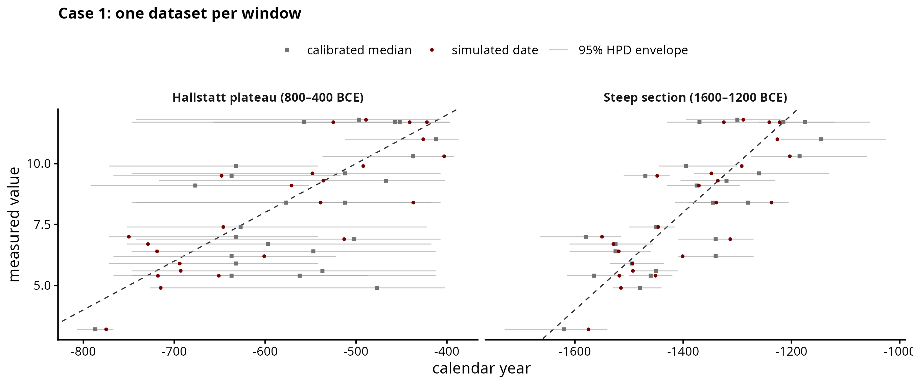
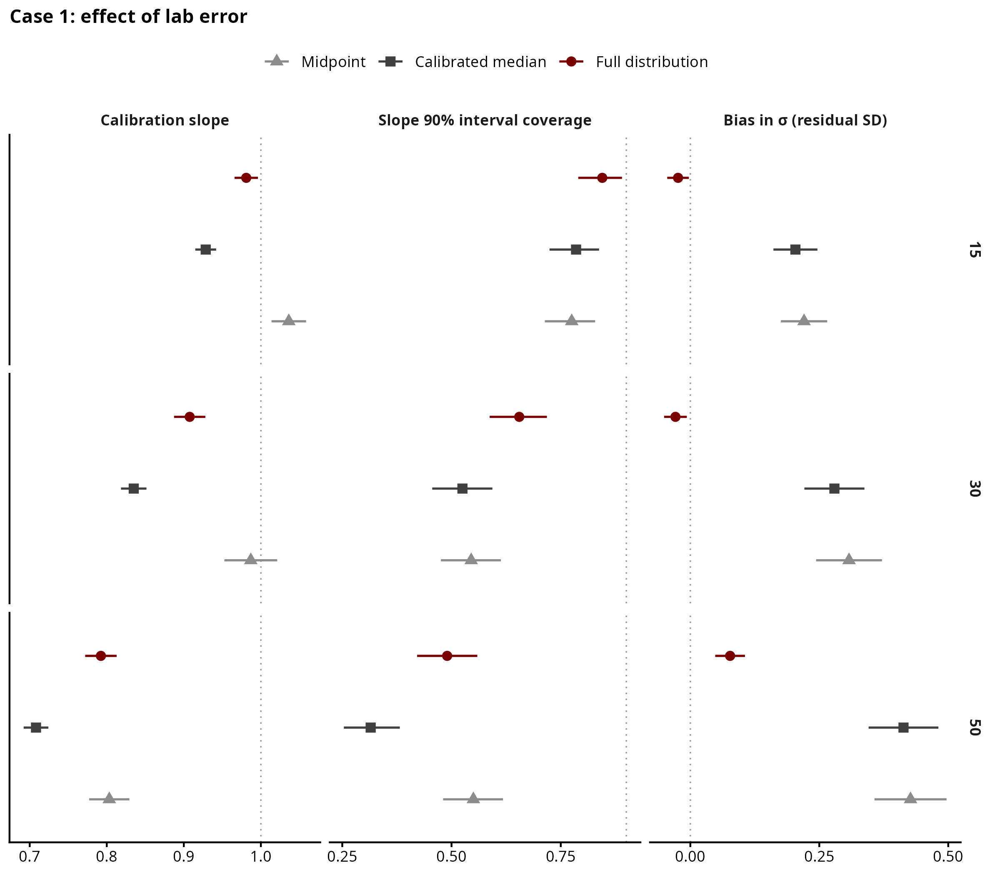
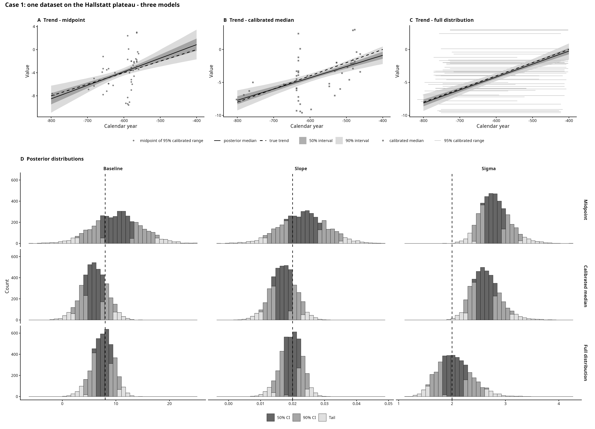

# Case 1 — Radiocarbon

## The archaeological case

This is the case of samples dated by radiocarbon. Each sample has a measured
value and a calibrated date, which is a probability distribution over calendar
years. Unlike the other cases, the date is not a range known to contain the true
date: it is peaked, often has several peaks, and comes from a noisy measurement.

We test whether the trend can be recovered from calibrated dates, and whether a
model given the full calibrated distribution performs better than models that use
the midpoint of the 95% range or the calibrated median. This is the only case
where midpoint and median are different numbers.

## How the data is generated

For each sample, in `scripts/simulate.R`:

1. A true date in the study window. Evenly spread, or denser towards the end
   (`growth_ratio`).
2. A radiocarbon age: the IntCal20 value at that date plus noise. The noise
   combines the lab error and the error of the curve itself (about 12-16 yr in
   these windows), because `rcarbon::calibrate()` assumes both.
3. A measured value, `intercept + slope * true date + noise`.

Two windows of 400 yr:

| Window | Mean 95% range | Median vs midpoint |
|---|---|---|
| 800-400 BCE, Hallstatt plateau | 223 yr | 45 yr apart on average, 98 max |
| 1600-1200 BCE, steep section | 147 yr | 9 yr apart on average, 25 max |

On the plateau calibrated dates are wide and a single date can have its 95% range
split in four. On the steep section they are narrow and have one peak.

The design (`scripts/01_design.R`), 100 datasets per setting, 1600 in total:

| Sweep | Varies |
|---|---|
| core | dataset size 50, 100, 200, 500; slope random or zero; on the plateau |
| factor | lab error 15, 30, 50 crossed with window; N = 200 |
| deposition | samples 4 times denser at the end, both windows |

Limitation: curve error is drawn independently for each date. In reality one
IntCal20 error moves neighbouring dates together, and no model here can absorb that.

## Feeding the models

Dates are calibrated with `rcarbon::calibrate()`, once per dataset, and all three
models see the same calibrated dates.

The midpoint model uses the centre of the 95% range (on average the range keeps
97.5% of the calibrated probability). The median model uses the calibrated median.
The full-distribution model gets the whole calibrated distribution on a 5-year
grid, gaps between peaks included.

`rcarbon` calibrates with a flat prior over the whole calibration curve, so the
model is not told the study window. The grid is padded by 588 yr on each side (the
widest calibrated date over both windows and all lab errors) so no date is cut.

## Results

Recovery study of 2026-09-08, uniform deposition only:

| Model | Plateau: slope ratio | coverage | σ bias | Steep: slope ratio | coverage | σ bias |
|---|---|---|---|---|---|---|
| Midpoint | 1.11 | 0.83 | +0.28 | 0.80 | 0.43 | +0.14 |
| Calibrated median | 0.82 | 0.73 | +0.26 | 0.82 | 0.47 | +0.14 |
| Full distribution | 0.96 | 0.84 | -0.03 | 0.83 | 0.49 | +0.01 |

On the plateau the three models separate. The full-distribution model recovers the
slope and sigma, the midpoint steepens the slope and the median flattens it. No
model reaches 0.90 coverage.

Accuracy and precision of the point estimates (posterior medians), from
`output/recovery_table.csv`. Slope values are in units of 10⁻³ per year. True
slopes are drawn uniformly between -30 and +30 in these units, or set to 0 in the
zero-slope datasets. Bias is ± 1 Monte Carlo SE.

| Window | Model | Slope bias | Slope RMSE | Slope empirical SE | 90% interval width | σ bias | σ RMSE | σ empirical SE |
|---|---|---|---|---|---|---|---|---|
| Plateau | Midpoint | -0.03 ± 0.15 | 4.92 | 4.92 | 11.74 | +0.28 ± 0.01 | 0.54 | 0.46 |
| Plateau | Calibrated median | -0.03 ± 0.12 | 3.88 | 3.88 | 7.74 | +0.26 ± 0.01 | 0.50 | 0.43 |
| Plateau | Full distribution | -0.02 ± 0.10 | 3.46 | 3.46 | 8.04 | -0.03 ± 0.01 | 0.22 | 0.21 |
| Steep | Midpoint | -0.15 ± 0.23 | 3.97 | 3.97 | 4.23 | +0.14 ± 0.01 | 0.26 | 0.22 |
| Steep | Calibrated median | -0.13 ± 0.21 | 3.64 | 3.65 | 4.33 | +0.14 ± 0.01 | 0.26 | 0.22 |
| Steep | Full distribution | -0.14 ± 0.21 | 3.61 | 3.61 | 4.33 | +0.01 ± 0.01 | 0.14 | 0.14 |

Slope bias is close to zero for every model, so slope RMSE and empirical SE are
almost equal: the error is spread, not a shift. This is why the slope ratio is
reported. True slopes lie on both sides of zero, and flattening or steepening
cancels in the mean error. The full-distribution model has the lowest RMSE for
both parameters on the plateau, and its intervals are wider than the median
model's (8.04 against 7.74), which is what brings its coverage closer to 0.90.
On the steep section slope RMSE and interval width barely differ between models.

On the steep section all three flatten the slope. Each calibrated date spreads
past the edges of the window, nothing ties the dates together, so the dates look
more spread out than they are and the slope flattens. `scripts/diagnostics/`
tests this (steep section, 120 datasets per setting):

| Condition | Lab error 15: slope ratio | coverage | Lab error 50: slope ratio | coverage |
|---|---|---|---|---|
| true dates | 1.01 | 0.88 | 1.01 | 0.92 |
| full distribution, as in the study | 0.94 | 0.73 | 0.73 | 0.23 |
| study window given | 1.02 | 0.88 | 1.01 | 0.90 |
| study window estimated | 1.02 | 0.86 | 1.01 | 0.92 |

Estimating the window (a normal prior on the dates) works as well as giving it,
and recovers its width to within 1% (401 and 404 yr). Still to check: the plateau,
and the zero-slope datasets (`07_period_full_check.R`).

Four times denser deposition at the end changes nothing we can detect with 100
datasets per setting. With no real trend, the 90% interval excludes zero in 12%
(midpoint), 13% (median) and 14% (full distribution) of datasets, against 10%
expected.

## Figures

| File | Shows |
|---|---|
| `figures/dataset_anatomy.png` | one dataset per window, before any fitting |
| `figures/single_fit_comparison.png` | one dataset, midpoint vs full distribution |
| `figures/recovery_summary.png` | headline result across all datasets |
| `figures/recovery_by_lab_error.png` | recovery by lab error and window |
| `figures/checks/` | calibrated dates overview, dataset size, deposition |

## Files

Run in order: `01` → `03` → `04`, then `02` and `05`.

| File | What it does |
|---|---|
| `scripts/simulate.R` | draws true dates and turns each into a radiocarbon age |
| `scripts/01_design.R` | builds the list of datasets to simulate, `data/design.csv` |
| `scripts/02_figures.R` | `dataset_anatomy.png` and `checks/overview.png` |
| `scripts/03_recovery_study.R` | calibrates each dataset and fits every model; about 3 h on 24 workers |
| `scripts/04_recovery_plots.R` | tables (`output/`) and figures |
| `scripts/05_single_fit.R` | `single_fit_comparison.png` |
| `scripts/checks/00_check_rows.R` | calibrated weight rows give the same medians as `rcarbon` |
| `scripts/checks/00_check_fit.R` | simulate, calibrate and fit one dataset |
| `scripts/diagnostics/` | why the steep section flattens the slope (`05_`), estimating the study window (`06_`, `07_`) |

Older runs are in `output/superseded_*`.
