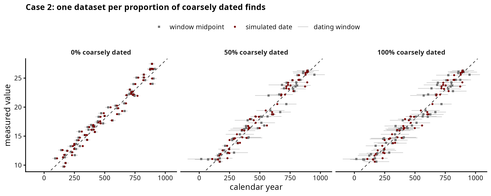
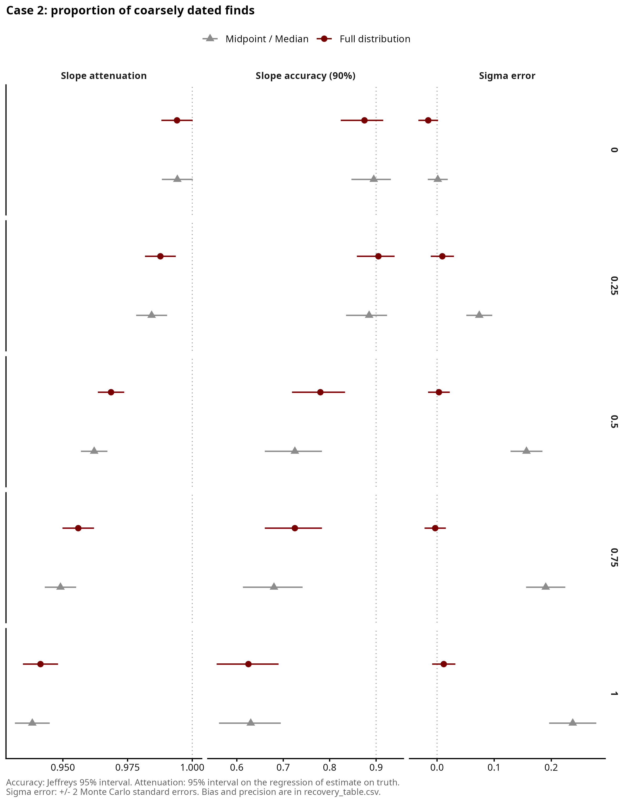
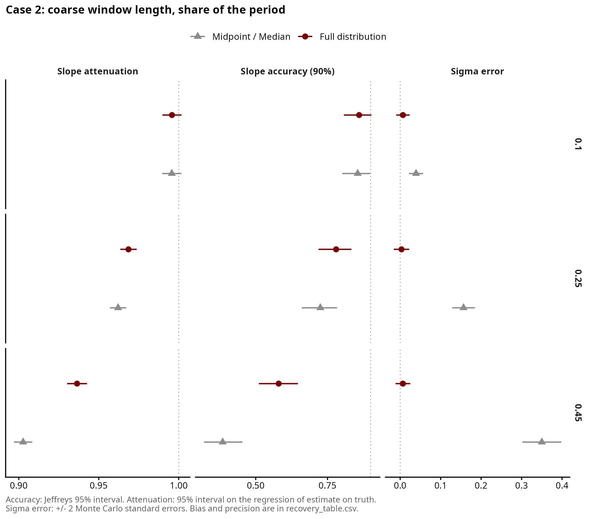
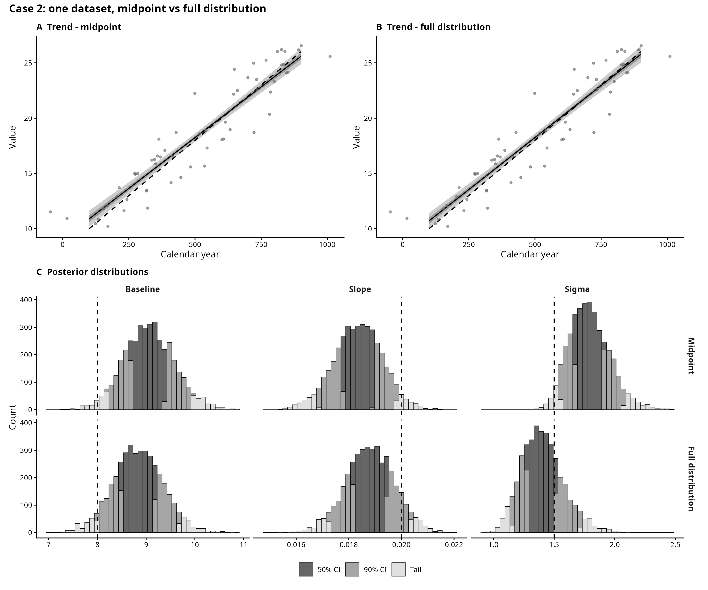

# Case 2 — Typochronology

## The archaeological case

This is the case of datasets where samples are dated using typochronology or
where the chronology comes from mixed information. For instance, a stratigraphic
unit of a floor with pottery from the 1st to the 4th century CE. If our sample is,
for instance, a bone, we consider its true date equally likely anywhere within
the reported range [*].

Each sample within a dataset is treated as independent, and it is reported
with a chronological range and a measured value. 

Some finds come from well-dated contexts (short windows), others from
mixed or poorly dated ones (long windows). We test whether we can recover the trend
from datasets with these mixed chronologies and whether a model which is given a full
probability distribution performs better than a model that uses midpoints. In this case
the full probability distribution is uniform.

[*] Limitation: unless a sample is known to be more likely deposited towards the
end of its reported range, its date cannot be skewed. In an earlier version of
this simulation (windows up to 25% of the study period,
`archive/superseded_run_20260916/`), dates leaning towards the late end of their
window did not worsen (nor improve) slope recovery for either model.

## How the data is generated

For each find, in `scripts/simulate.R`:

1. A 'true' simulated date in the study period. Evenly spread, or denser towards the end
   (parameter: `growth_ratio`).
2. Well or coarsely dated. The chance of being coarsely dated is
   `prop_coarse_samples`, or higher early in the period than late
   (`precision_trend`).
3. A window placed so it contains the true date at a random position. Well
   dated: 6.25% of the period (50 yr of 800). Coarsely dated: `coarse_frac` of
   the period, each find drawing its own length between 0.8 and 1.2 times that.
   Windows can run past the period. These parameters should be adjusted according
   to the period of interest.
4. A measured value, `intercept + slope * true date + noise`.

Window lengths are shares of the period because the result depends on how long
a window is compared with the period, not on its length in years. The period
100-900 stands in for any period: a coarse window of 25% is 200 yr in an 800-yr
study or 625 yr in a 2500-yr one. To read the results for a real dataset, divide
its typical coarse date range by its study period.

The design (`scripts/01_design.R`) changes one factor at a time and keeps the
rest at the reference (N = 200, 50% coarsely dated, coarse windows 25% of the
period, even deposition, no precision trend, random slope). 200 datasets per
setting, 3200 in total:

| Sweep | Varies |
|---|---|
| core | dataset size 50, 100, 200, 500; slope random or zero |
| prop | 0, 25, 75, 100% coarsely dated |
| width | coarse windows 10% or 45% of the period |
| deposition | finds 4 times denser at the end |
| precision | coarsely dated finds 80% at the start, 20% at the end |

0% and 100% coarsely dated are reference points, not "realistic" datasets.

## Feeding the models
> [!CAUTION]
> This section needs to be edited.

Both models (midpoint vs full distribution) see each sample's date range and measured value, 
not the true date.

The midpoint model places each find at the centre of its range, (start + end) / 2.

The full-distribution model gives each year of the range the same probability,
on a 5-year grid (to speed up computation). We do not provide the study period to the model,
so a range that is earlier or later than the period's boundaries keep part of the probability outside it.
In this case it should not be a huge issue since the deposition is uniform, but on a separate test
(just OLS) the slope seemed to be recovered better if the window was inside the study period (see results).

## Results
> [!CAUTION]
> This section needs to be written.

The full-distribution model recovers sigma in every setting. The midpoint model
overestimates it: once half or more of the finds are coarsely dated, its 90%
interval contains the true sigma in only 50-57% of datasets, and in 37% when
coarse windows are 45% of the period.

Both models flatten the slope as coarse dating increases, and the
full-distribution model is only slightly better (slope ratio 0.94 against 0.90
with coarse windows at 45% of the period). The flattening comes from the period
edges. In a separate test, cutting each range at the start and end of the period
brought the slope ratio back to 1.00 and slope coverage to about 90%.

Denser deposition at the end of the period, or coarse dating concentrated early,
changes the results very little. With no real trend, both models report one in
about 10% of datasets, as expected for a 90% interval.

## Figures

| File | Shows |
|---|---|
| `figures/dataset_anatomy.png` | one dataset per proportion of coarsely dated finds, before any fitting |
| `figures/single_fit_comparison.png` | one dataset, midpoint vs full distribution, fitted up close |
| `figures/recovery_summary.png` | headline result across all datasets |
| `figures/recovery_by_prop_coarse.png` | how the result changes with the proportion of coarsely dated finds |
| `figures/recovery_by_coarse_width.png` | how the result changes with coarse window length |
| `figures/checks/` | generator check, dataset size, deposition, precision trend |

## Files

Run in order: `01` → `03` → `04`, then `05`. No `02_` in this case.

| File | What it does |
|---|---|
| `scripts/simulate.R` | draws a true date, then a well or coarsely dated window around it |
| `scripts/01_design.R` | builds the list of datasets to simulate, `data/design.csv` |
| `scripts/03_recovery_study.R` | fits every model to every dataset; slow |
| `scripts/04_recovery_plots.R` | turns the fits into tables (`output/`) and figures. `recovery_table.csv` is the core sweep with a random slope; `recovery_by_noise.csv` splits it by noise ratio |
| `scripts/05_single_fit.R` | `single_fit_comparison.png` |
| `scripts/checks/00_check.R` | generator check figure, and `dataset_anatomy.png` |
| `scripts/checks/00_check_median_identity.R` | median equals midpoint for a flat window, so median is not fitted |

The previous design (grid-snapped windows, fine/coarse mix, skew, overhang and
position sweeps) and its results are in `archive/superseded_run_20260916/`.

Detailed findings so far: `findings.md`.
