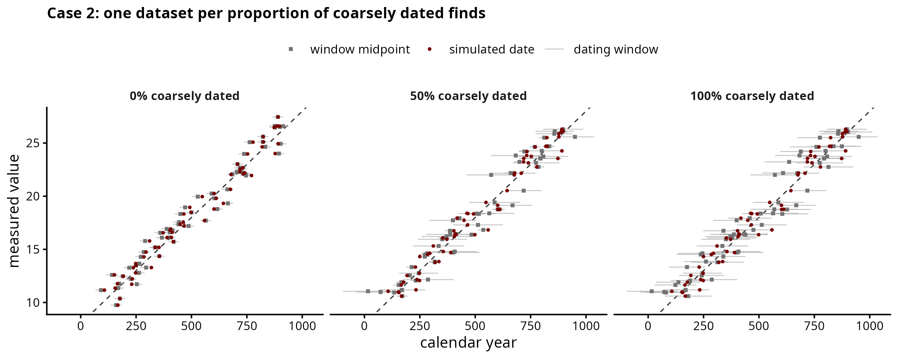
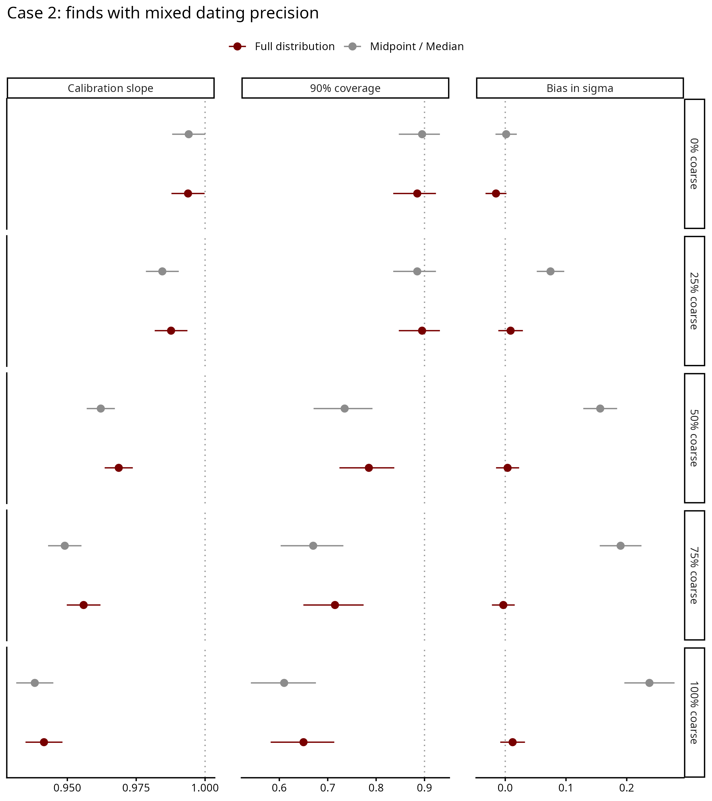
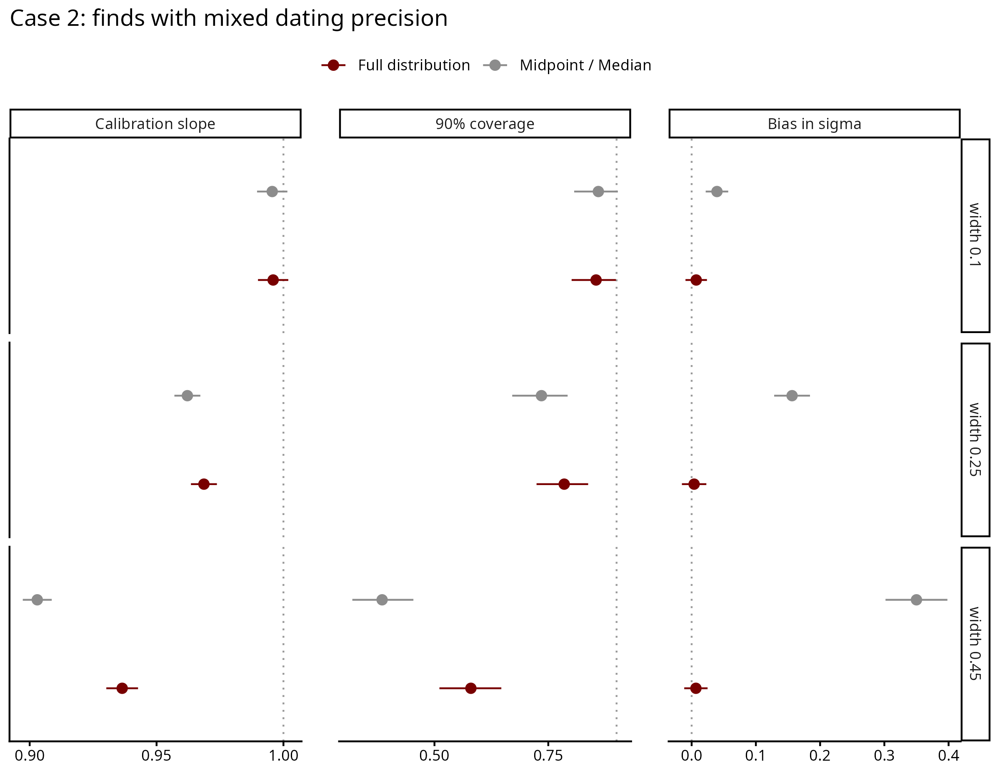
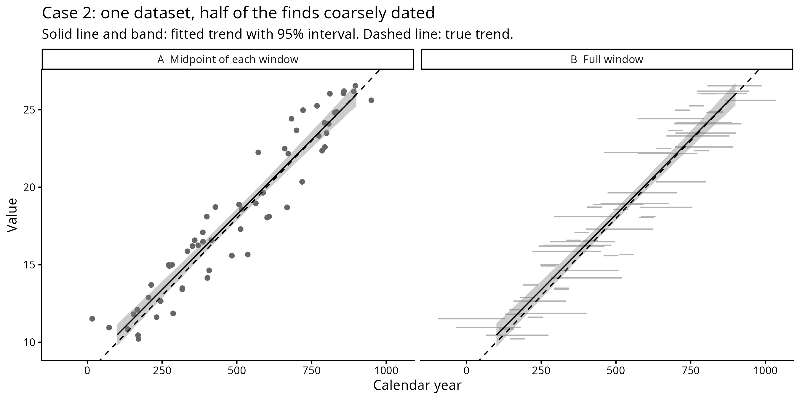

# Case 2 — Typochronology

## The archaeological case

This is the case of datasets where samples are dated using typochronology or
where the chronology comes from mixed information. For instance, a stratigraphic
unit of a floor with pottery from the 1st to the 4th century CE. If our sample is,
for instance, a bone, we consider its true date equally likely anywhere within
the reported range [*].

Each sample within a dataset is treated as independent, and it is reported
with a chronological range and a measured value. 

Some finds come from well-dated contexts (short windows), others from
mixed or poorly dated ones (long windows). We test whether we can recover the trend
from datasets with these mixed chronologies and whether a model which is given a full
probability distribution performs better than a model that uses midpoints. In this case
the full probability distribution is uniform.

[*] Limitation: unless a sample is known to be more likely deposited towards the
end of its reported range, its date cannot be skewed. In an earlier version of
this simulation (windows up to 25% of the study period,
`archive/superseded_run_20260916/`), dates leaning towards the late end of their
window did not worsen (nor improve) slope recovery for either model.

## How the data is generated

For each find, in `scripts/simulate.R`:

1. A 'true' simulated date in the study period. Evenly spread, or denser towards the end
   (parameter: `growth_ratio`).
2. Well or coarsely dated. The chance of being coarsely dated is
   `prop_coarse_samples`, or higher early in the period than late
   (`precision_trend`).
3. A window placed so it contains the true date at a random position. Well
   dated: 6.25% of the period (50 yr of 800). Coarsely dated: `coarse_frac` of
   the period, each find drawing its own length between 0.8 and 1.2 times that.
   Windows can run past the period. These parameters should be adjusted according
   to the period of interest.
4. A measured value, `intercept + slope * true date + noise`.

Window lengths are shares of the period because the result depends on how long
a window is compared with the period, not on its length in years. The period
100-900 stands in for any period: a coarse window of 25% is 200 yr in an 800-yr
study or 625 yr in a 2500-yr one. To read the results for a real dataset, divide
its typical coarse date range by its study period.

The design (`scripts/01_design.R`) changes one factor at a time and keeps the
rest at the reference (N = 200, 50% coarsely dated, coarse windows 25% of the
period, even deposition, no precision trend, random slope). 200 datasets per
setting, 3200 in total:

| Sweep | Varies |
|---|---|
| core | dataset size 50, 100, 200, 500; slope random or zero |
| prop | 0, 25, 75, 100% coarsely dated |
| width | coarse windows 10% or 45% of the period |
| deposition | finds 4 times denser at the end |
| precision | coarsely dated finds 80% at the start, 20% at the end |

0% and 100% coarsely dated are reference points, not "realistic" datasets.

## Feeding the models

Both models see each find's range and measured value, not the true date.

The midpoint model puts each find at the centre of its range, (start + end) / 2.
The median is not fitted: for a flat range it is the same as the midpoint.

The full-distribution model gives every year of the range the same probability,
on a 5-year grid to speed things up. The model is not told the study period (the
period decides which finds enter the study, it is not part of the model;
supervisor, 2026-09-22), so a range that runs past the start or end of the period
keeps part of its probability outside it. This matters, see the results.

## Results

At the reference setting (N = 200, half the finds coarsely dated, coarse windows
25% of the period), 200 datasets:

| | Midpoint | Full distribution |
|---|---|---|
| Slope ratio | 0.96 | 0.97 |
| Slope coverage | 0.73 | 0.78 |
| Sigma bias | +0.16 | 0.00 |
| Sigma coverage | 0.52 | 0.89 |

The full distribution fixes sigma. The midpoint overestimates it, more so as
dating gets coarser (coverage 0.37 with coarse windows at 45% of the period,
against 0.92 for the full distribution).

Both models flatten the slope, the full distribution only a bit less. With more
coarsely dated finds the slope ratio goes from 0.99 to 0.94 for both. With
longer coarse windows it goes to 0.90 (midpoint) and 0.94 (full distribution) at
45% of the period, with slope coverage 0.39 and 0.58.

For the midpoint this is expected. The true date is drawn first and the range
placed around it, which is classical error, and it flattens the slope by
`1 / (1 + mean(width^2) / period^2)`: 0.97 expected against 0.96 fitted at the
reference, 0.91 against 0.90 at 45% windows.

The full distribution flattens because ranges run past the period edges and the
model does not know where the period is. Cutting the ranges at the edges brings
the slope ratio back to 1.00 and coverage to about 0.90 (separate test, not used
in the study since the period is only an inclusion criterion). So this stays as
a limitation.

Denser deposition at the end, or coarse dating more common early, changes very
little. With no real trend both models report one in about 10% of datasets, as
expected.

A continuous spread of widths instead of two groups (same mean squared width)
gives the same numbers: slope ratio 0.96 either way for the midpoint, 0.97 for
the full distribution (`scripts/checks/01_check_continuous_widths.R`).

## Figures

| File | Shows |
|---|---|
| `figures/dataset_anatomy.png` | one dataset per proportion of coarsely dated finds, before any fitting |
| `figures/single_fit_comparison.png` | one dataset, midpoint vs full distribution, fitted up close |
| `figures/recovery_summary.png` | headline result across all datasets |
| `figures/recovery_by_prop_coarse.png` | how the result changes with the proportion of coarsely dated finds |
| `figures/recovery_by_coarse_width.png` | how the result changes with coarse window length |
| `figures/checks/` | generator check, dataset size, deposition, precision trend |

## Files

Run in order: `01` → `03` → `04`, then `05`. No `02_` in this case.

| File | What it does |
|---|---|
| `scripts/simulate.R` | draws a true date, then a well or coarsely dated window around it |
| `scripts/01_design.R` | builds the list of datasets to simulate, `data/design.csv` |
| `scripts/03_recovery_study.R` | fits every model to every dataset; slow |
| `scripts/04_recovery_plots.R` | turns the fits into tables (`output/`) and figures. `recovery_table.csv` is the core sweep with a random slope; `recovery_by_noise.csv` splits it by noise ratio |
| `scripts/05_single_fit.R` | `single_fit_comparison.png` |
| `scripts/checks/00_check.R` | generator check figure, and `dataset_anatomy.png` |
| `scripts/checks/00_check_median_identity.R` | median equals midpoint for a flat window, so median is not fitted |
| `scripts/checks/01_check_continuous_widths.R` | two groups of widths against a continuous spread; writes `output/check_continuous_widths*.csv` |

The previous design (grid-snapped windows, fine/coarse mix, skew, overhang and
position sweeps) and its results are in `archive/superseded_run_20260916/`.
