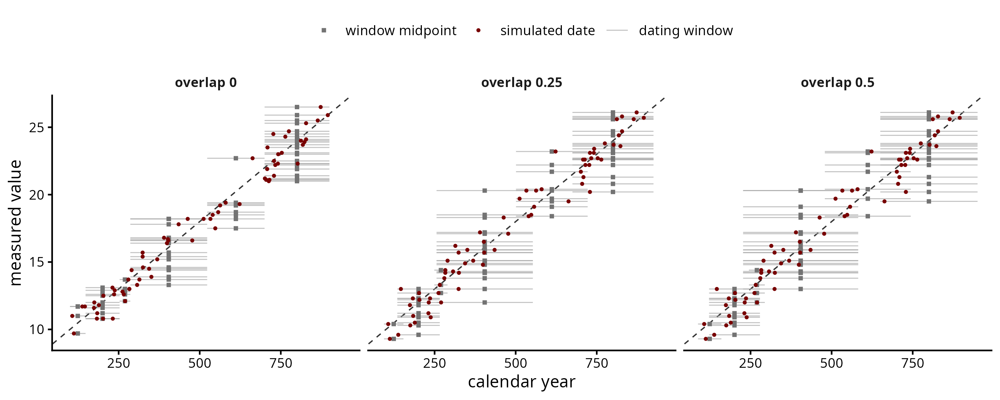
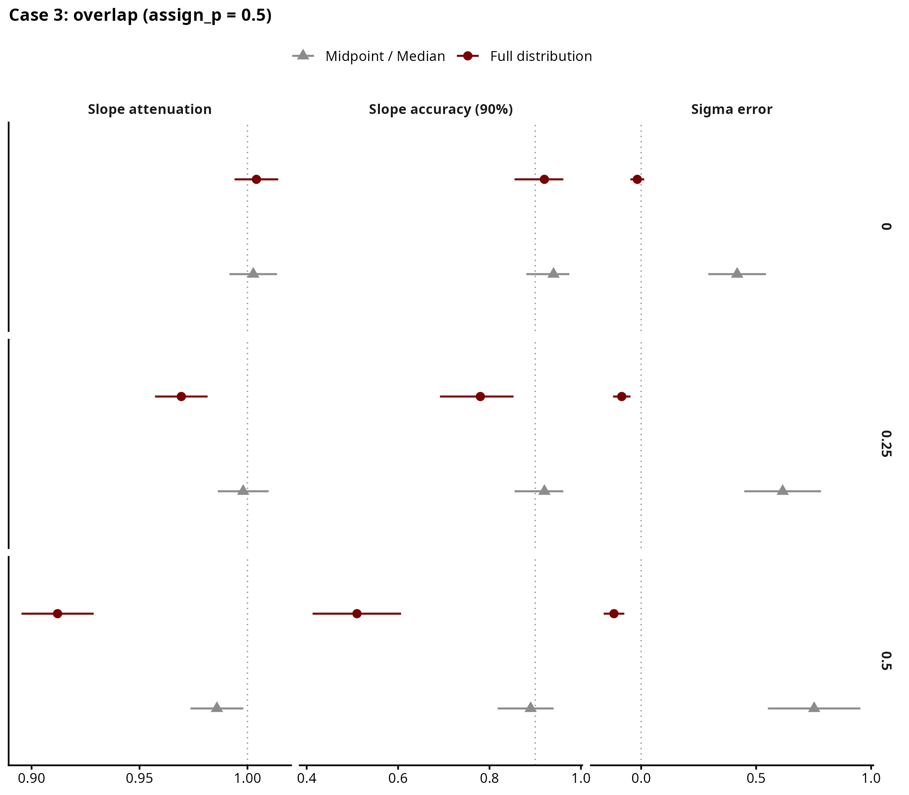
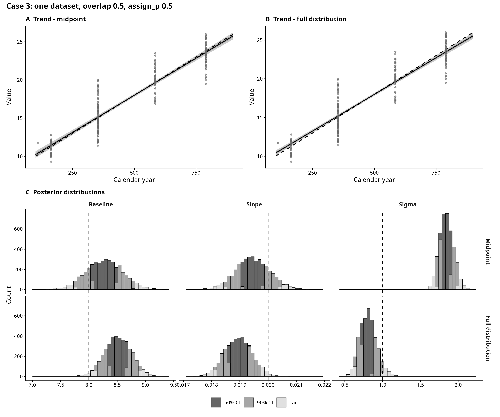

# Case 3 — Overlapping phases

## The archaeological case

This case covers finds dated to phases that overlap, as ceramic phases often
do. For instance, a sherd whose type is attested in both "Phase II" and
"Phase III" and is assigned to one of them. The find is reported with the
range of the phase it was assigned to and a measured value.

Unlike Case 2, all finds in a dataset share the same phases. We test whether
the trend can be recovered when the recorded phase window is wider than the
phase and some finds are given the neighbouring phase, and whether a model
given the full probability distribution (flat over the phase window) does
better than a model that uses midpoints.

## How the data is generated

For each dataset, in `scripts/simulate.R`:

1. The study period (100-900) is split into K phases (5 to 10) of random
   length. How uneven the lengths are is set by `alpha_conc`, drawn per dataset.
2. Each phase's recorded window is stretched past its boundaries by `overlap`
   times its own length, half on each side. At 0 the phases just touch. The
   first and last windows run past the study period.

For each find:

3. A true date, evenly spread across the period.
4. If the date falls where two windows overlap, the find is assigned to the
   earlier phase with probability `assign_p` (0.5 is a coin flip, lower values
   push finds to the later phase).
5. A measured value, `intercept + slope * true date + noise`.

The design (`scripts/01_design.R`), 100 datasets per setting, 1500 in total:

| Sweep | Varies |
|---|---|
| core | dataset size 50, 100, 200, 500; slope random or zero; at overlap 0.5, assign_p 0.2 |
| factor | overlap 0, 0.25, 0.5 crossed with assign_p 0.5, 0.35, 0.2; at N = 200 |

assign_p does nothing without overlap, so overlap 0 appears once.

## Feeding the models

Both models see each find's phase window and measured value, not the true
date. The midpoint model places each find at the centre of its window. The
full-distribution model spreads it evenly across the window, on a 5-year grid.
The median is not fitted: for a flat window it equals the midpoint.

The grid is padded by 249 yr on each side so no stretched window is cut.

## Results

Overlap does not flatten the midpoint slope. With plain least squares the
midpoint slope ratio stays between 0.994 and 1.002 at every overlap and
assign_p (`scripts/checks/00_check.R`). A low assign_p shifts the dates a phase
keeps by about the same number of years in every phase, which moves the
intercept, not the slope.

The midpoint model overestimates sigma: its 90% interval contains the true
sigma in 29-53% of datasets. The full-distribution model does better (72-92%).

The full-distribution model flattens the slope instead. At assign_p 0.5 the
slope ratio is 1.00 without overlap, 0.97 at overlap 0.25 and 0.91 at 0.5, and
slope coverage drops to 0.51. The midpoint stays at 0.99. The cause is the shape
of the window. Inside a stretched window the true dates are not flat: the shared
strips hold about half as many as the phase's own span, since the other half go
to the neighbouring phase. The midpoint only uses the centre, which does not
move. The full-distribution model uses the whole (wrong) flat shape. Given the
true shape instead, its slope ratio went from 0.945 to 0.999 (one-off test at
overlap 0.5, assign_p 0.5, 2026-09-15). The size of the effect depends on how
far the windows are stretched, which is a choice of this simulation.

With no real trend, the 90% interval excludes zero in 12% (midpoint) and 14%
(full distribution) of datasets, against 10% expected.

An earlier version cut the first and last windows at the period edges. That
inflated the midpoint slope (ratio about 1.07 at overlap 0.5) and was dropped.

## Figures

| File | Shows |
|---|---|
| `figures/dataset_anatomy.png` | one dataset per overlap level, before any fitting |
| `figures/single_fit_comparison.png` | one dataset at overlap 0.5, assign_p 0.5, both models |
| `figures/recovery_summary.png` | core sweep, random slope |
| `figures/recovery_by_overlap.png` | recovery by overlap, at assign_p 0.5 |
| `figures/checks/` | dataset size, assign_p at overlap 0.5, true dates kept by one phase |

## Files

Run in order: `01` → `03` → `04`, then `05`.

| File | What it does |
|---|---|
| `scripts/simulate.R` | draws the phases, stretches their windows and assigns each find to a phase |
| `scripts/01_design.R` | builds the list of datasets to simulate, `data/design.csv` |
| `scripts/03_recovery_study.R` | fits every model to every dataset; slow |
| `scripts/04_recovery_plots.R` | tables (`output/`) and figures |
| `scripts/05_single_fit.R` | `single_fit_comparison.png` |
| `scripts/checks/00_check.R` | midpoint slope ratio without Stan, and `check_depletion.png` |
