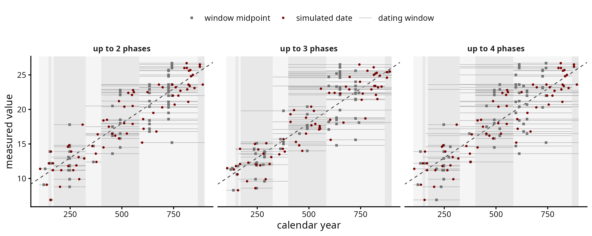
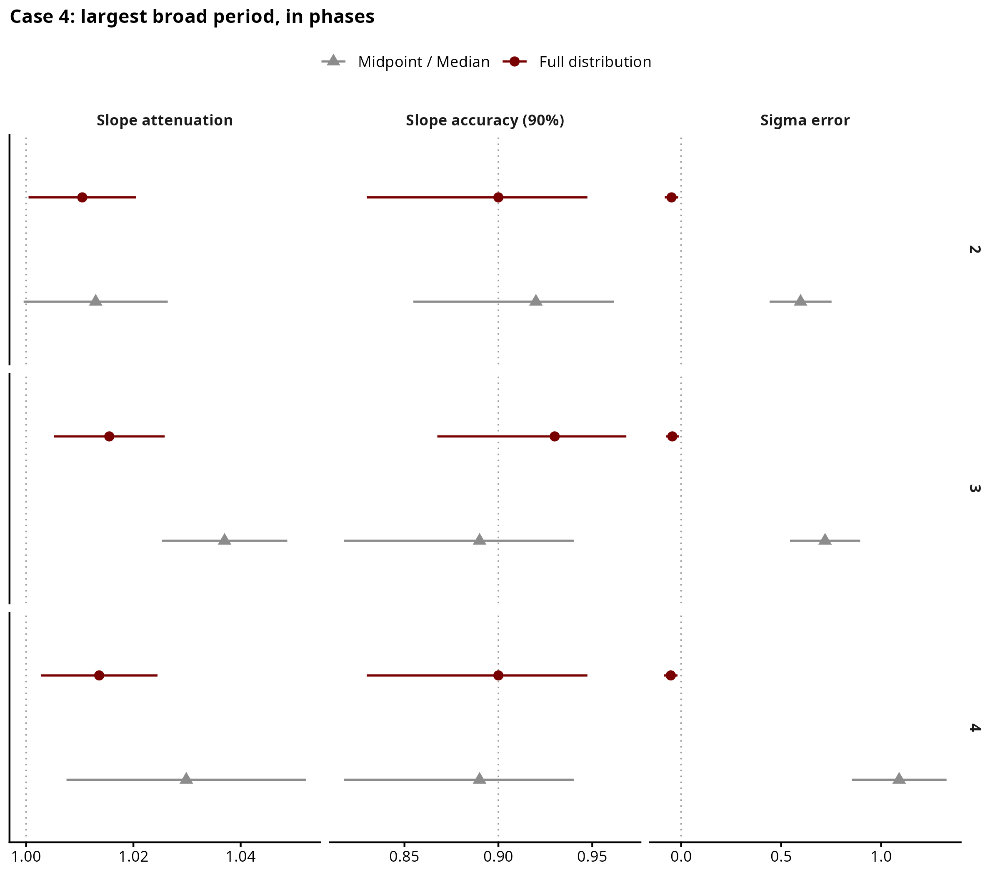
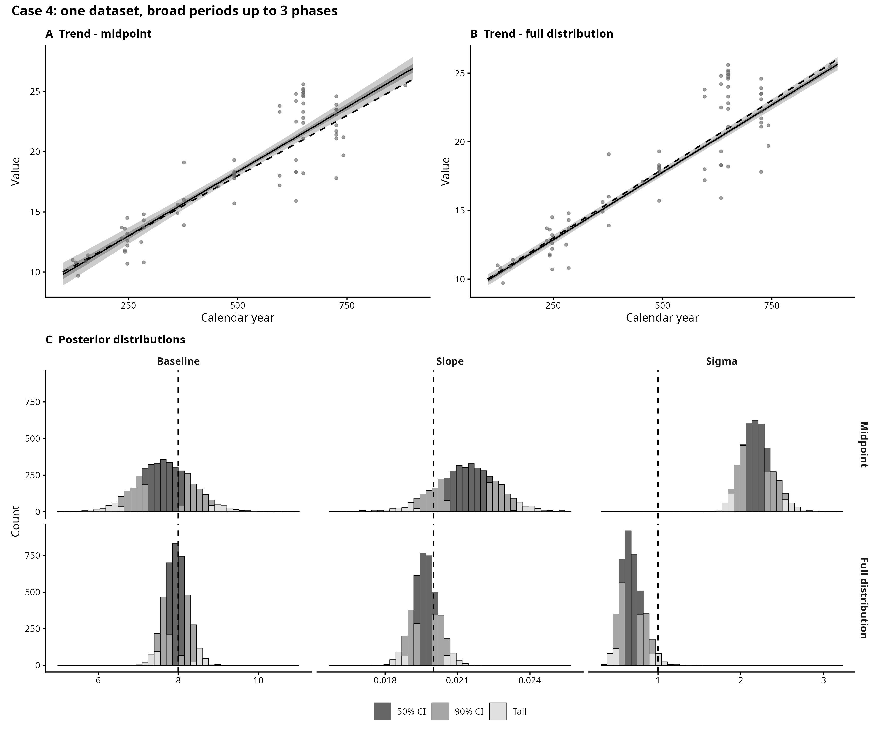

# Case 4 — Merged phases

## The archaeological case

This case covers datasets where finds are dated on one phase scheme but at
different levels of detail. Some finds are dated to a single fine phase
("Late Roman 2"), others only to a broader period made of adjacent phases
("Late Roman"). This is common in excavation reports, where the usual choice is
to analyse the two groups separately or to drop the broadly dated finds.

We test whether both groups can go into one model, and whether a model given the
full probability distribution (flat over the phase or broad period) does better
than a model that uses midpoints.

> [!NOTE]
> Open question for the supervisor: here each find draws its own run of phases
> (merged). A fixed hierarchy of periods (nested) is the alternative design.

## How the data is generated

For each dataset, in `scripts/simulate.R`:

1. The study period (100-900) is split into K fine phases (5 to 10) of random
   length. How uneven the lengths are is set by `alpha_conc`, drawn per dataset.

For each find:

2. A true date, evenly spread across the period.
3. A number of phases between 1 and `merge_max`. The find is dated to a run of
   that many adjacent phases that includes its own, placed at random around it.
   With 1 the find keeps its fine phase.
4. A measured value, `intercept + slope * true date + noise`.

Windows never leave the study period.

The design (`scripts/01_design.R`), 100 datasets per setting, 1100 in total:

| Sweep | Varies |
|---|---|
| core | dataset size 50, 100, 200, 500; slope random or zero; merge_max 3 |
| merge | merge_max 2, 3, 4; at N = 200 |

## Feeding the models

Both models see each find's window and measured value, not the true date. The
midpoint model places each find at the centre of its window. The
full-distribution model spreads it evenly across the window, on a 5-year grid.
The median is not fitted: for a flat window it equals the midpoint.

## Results

Both models recover the slope (slope ratio 1.01-1.04, coverage 0.87-0.93).

The midpoint model overestimates sigma, more so as broad periods get wider
(sigma error 0.60, 0.72 and 1.09 at merge_max 2, 3 and 4). Its 90% interval
contains the true sigma in about a third of datasets. The full-distribution
model recovers sigma (coverage 0.88-0.93).

With no real trend, the 90% interval excludes zero in 9% (midpoint) and 10%
(full distribution) of datasets, against 10% expected.

## Figures

| File | Shows |
|---|---|
| `figures/dataset_anatomy.png` | one dataset per merge level, before any fitting |
| `figures/single_fit_comparison.png` | one dataset, both models |
| `figures/recovery_summary.png` | core sweep, random slope |
| `figures/recovery_by_merge.png` | recovery by merge_max |
| `figures/checks/` | dataset size |

## Files

Run in order: `01` → `03` → `04`, then `05`.

| File | What it does |
|---|---|
| `scripts/simulate.R` | draws the fine phases and dates each find to a run of them |
| `scripts/01_design.R` | builds the list of datasets to simulate, `data/design.csv`, and checks the generator |
| `scripts/03_recovery_study.R` | fits every model to every dataset; slow |
| `scripts/04_recovery_plots.R` | tables (`output/`) and figures |
| `scripts/05_single_fit.R` | `single_fit_comparison.png` |
