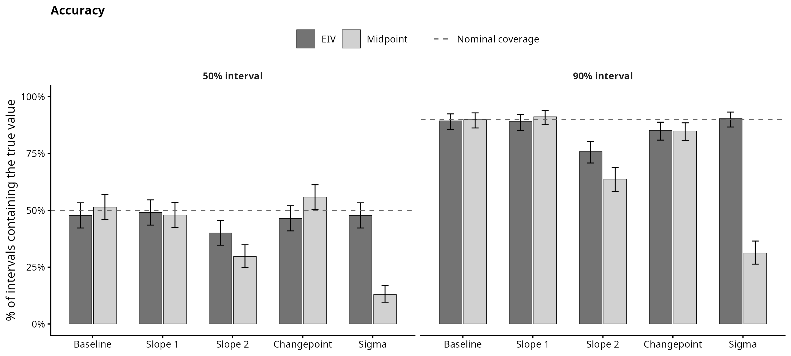
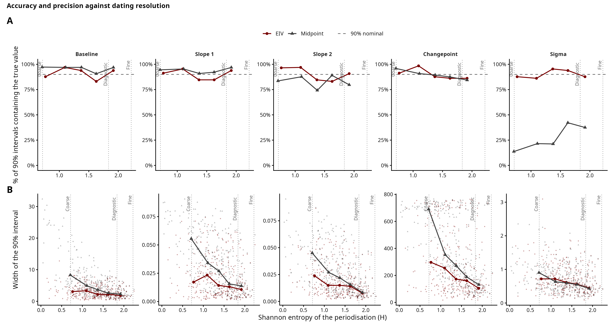
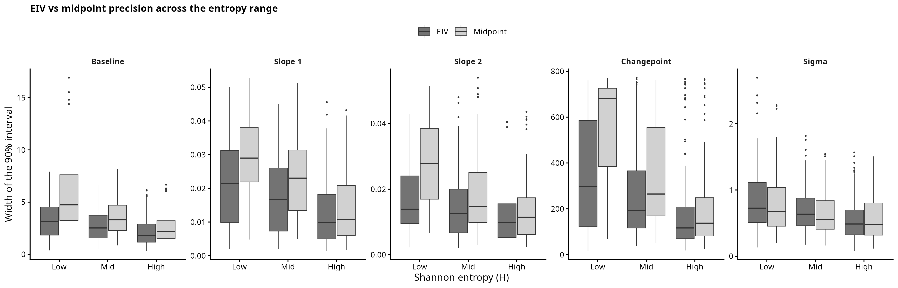
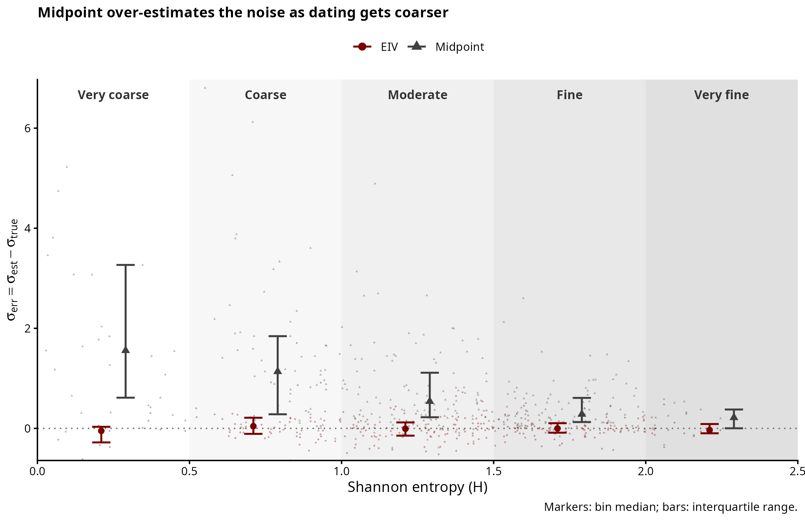
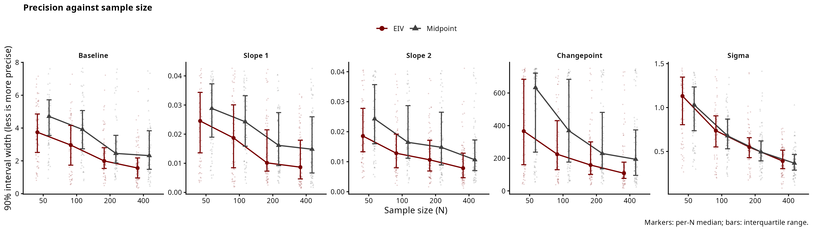

# Simulation 2: Changepoint Regression

A continuous measurement is assumed to follow a segmented temporal trend — two
straight segments meeting at a single changepoint, continuous at the join:

$$
f(t) =
\begin{cases}
\text{baseline} + \text{slope}_1 (t - t_{\min}) & t \le \text{changepoint} \\[4pt]
\text{baseline} + \text{slope}_1 (\text{changepoint} - t_{\min}) + \text{slope}_2 (t - \text{changepoint}) & t > \text{changepoint}
\end{cases}
$$

Each observation is dated only to a phase `[Start_date, End_date]`, not to a
year. Does treating each date as a latent parameter within its phase recover the
trend better than collapsing the phase to its midpoint?

As a single example: baseline = 8, slope_1 = 0.015, slope_2 = -0.01,
changepoint = 500 CE, noise $\sim \mathcal{N}(0, 1.5)$. The timeline is 100–900 CE, periodised
into 6 phases.

## Periodisation and dating resolution

Periodisation works as in the linear simulation: the timeline is split into `K`
phases by a Dirichlet broken stick, and each observation inherits the
`[Start_date, End_date]` of its phase, so dating uncertainty is structured, not
random. Each dataset draws its own $K \sim \mathcal{U}\{3, \ldots, 10\}$ and concentration
$\alpha_{\text{conc}} = 10^{\,2 \cdot \text{Beta}(2,\, 3.5)\, -\, 1}$. Resolution is summarised by the Shannon
entropy of the phase weights, $H = -\sum_k p_k \log p_k$: even phases give high H, one
dominant phase gives low H. The prior predictive check lives with the linear
simulation (`Sim_Linear/00_periodisation_check.R`).

## Scripts

`simulate.R` holds the shared generating process (the `simulate_changepoint()`
function, the `partition_timeline()` periodisation helper, and constants); it is
sourced by both the worked example and the study, so the two provably use the same
process. The pipeline is then:

| Script | Purpose | Output |
|---|---|---|
| `01_example.R` | draw ONE dataset, show it, fit both models, compare | `figures/exploratory_panel.png`, `model_comparison_single_fit.png`, `individual_date_posteriors.png` |
| `02_recovery_study.R` | draw MANY random plausible datasets (each with its own baseline, two slopes, changepoint, noise, sample size, and periodisation), fit both models, record whether each interval contains the truth and how wide it is | `output/recovery_results.csv` |
| `03_recovery_plots.R` | the study figures | `figures/recovery.png`, `accuracy.png`, `accuracy_precision_composite.png`, `precision_vs_entropy.png`, `sigma_vs_entropy.png`, `accuracy_vs_entropy.png`, `precision_boxplots.png`, `precision_vs_n.png` |
| `04_convergence_diagnostic.R` | inspect which datasets fail to converge, contrasting periodisation resolution with changepoint detectability | `figures/convergence_diagnostic.png` |
| `05_marginal_rescue_check.R` | experimental: refit the marginalized EIV model (below) on exactly the datasets the ordinary EIV model failed to converge on, and report the rescue rate | `output/marginal_rescue_check.csv` |

The example (`01`) fits in seconds; the study (`02`) is ~800 fits over a few
minutes, so plotting (`03`) is separate. Sample size is swept across
$N \in \{50, 100, 200, 400\}$. To keep every changepoint genuine, the slopes are drawn
as $\text{slope}_1 \sim \mathcal{U}(-0.03, 0.03)$ and $\text{slope}_2 = \text{slope}_1 \pm \mathcal{U}(0.01, 0.05)$ — the slope
change is random but never negligible, so the changepoint stays identifiable.

## Exploratory panel

## Errors-in-variables (EIV) inference

The EIV model treats each true date as a latent parameter, uniform within its
phase:

$$
\begin{aligned}
\mu(t) &= \alpha + \beta_1 t + (\beta_2 - \beta_1) \max(0,\, t - \text{changepoint}) \\
y_n &\sim \mathcal{N}\!\left(\mu(\text{true\_date}_n),\ \sigma\right)
\end{aligned}
$$

Before the changepoint the last term is zero and the mean is $\alpha + \beta_1 t$;
after it the slope becomes $\beta_2$, the segments meeting continuously, so
$\beta_2 - \beta_1$ is the change in slope. The changepoint is a free parameter with a
uniform prior, fit jointly; its true value (500 CE) is only used afterwards to
check recovery.

Left panels: the recovered trend with a sample's phase (shaded) and value
(dashed). Right panels: each date's posterior, with the phase boundaries (dashed)
and the true date (solid). Observations in a long phase stay broadly uncertain —
the model does not invent precision it lacks.

## Model comparison on a single dataset

The midpoint model fixes each date at the centre of its phase. On a single
dataset both recover the trend, but the midpoint returns a larger sigma: the
within-phase date spread it ignores ends up in the residual.

## Recovery study

One dataset cannot rule out lucky parameters, so the study draws many — each with
its own baseline, two slopes, changepoint, noise, sample size, and periodisation.
Both models are fit to all of them, recording how often the 50% / 90% interval
holds the truth (accuracy) and how wide it is (precision). The changepoint
posterior is harder to sample than the linear one, so about a fifth of fits are
dropped for non-convergence (max Rhat > 1.05 or divergences). The accuracy rates
are essentially unchanged with or without this filter.

`04_convergence_diagnostic.R` asks whether the dropped fits are weak-signal cases
or just hard geometries. Detectability is a kink/noise ratio: the slope change
times the distance from the changepoint to the nearer data edge, over sigma (a
sharp bend away from the edges is easy to see; wide scatter hides it).
Non-convergence tracks the periodisation resolution — coarse periodisations (low
H, one long phase) converge less often — far more than it tracks a weak kink, so
the dropped fits are not simply the weakest changepoints.

*Preliminary results*. Both recover the baseline, first slope, and changepoint location at
near-nominal accuracy, at any resolution. They diverge mainly in three places. 

1. Precision: the EIV intervals for the structural parameters are tighter, roughly
35–70% narrower for the baseline, both slopes, and the changepoint, since the
midpoint throws away the within-phase spread that constrains the trend (I think?). 

2. Sigma: the midpoint reads the within-phase date spread as noise and overestimates it, so
its 90% interval contains the true sigma only ~31% of the time against ~90% for EIV,
and worse as phases coarsen. 

3. `slope_2`: the post-changepoint segment is
under-covered by both models. In the EIV model accuracy is ~76% at 90%; in the midpoint model is slightly worse (~64% at 90% interval). 

Precision improves with sample size for both models, as expected.

Overall calibration. For each parameter, the share of datasets whose 50% and 90%
interval actually held the true value. The dashed line shows the nominal rates; the whiskers are 95% Jeffreys intervals.

### Accuracy and precision against dating resolution

These plots show if an interval is accurate (does the 90% interval hold the truth?) and
precise (width of the 90% interval). Panel A shows the accuracy and panel B shows the
precision, both across the entropy range.

Unlike the linear case, the trend here bends at the changepoint, meaning that the midpoint is no
longer the average of the possible dates. The two models diverge on the parameters near the kink: for Slope 2, the changepoint, and sigma the midpoint misses the truth more
often than EIV and is also wider. For coarser phases, sigma is more accurate in the EIV model:

### Further checks #1: Sample size

We also check how sample size affects the precision: both models show a steady improvement
in precision as sample size increases.

### Further checks #2: Convergence

The changepoint posterior is harder to sample. Since some fits did not converge, we tried to also check which fits in particular were failing (see the preliminary results above and `04_convergence_diagnostic.R`).

## Marginalized latent dates (experimental)

The ordinary EIV model gives every observation its own free date parameter,
sampled uniformly within its window. For a bone whose window straddles the
changepoint that parameter effectively has to pick a side (before or after
the kink), and different MCMC chains can settle on different sides — a
multimodality that shows up as high Rhat, divergences, and dropped fits (the
~20% non-convergence rate above). `models/sim_changepoint_marginal.stan`
removes the per-observation date parameters entirely: instead of sampling a
date, each observation's likelihood integrates the date out over a 40-point
grid spanning its window (the same uniform-within-window assumption, just
computed by quadrature instead of by MCMC). No date parameter means no
per-observation mode for chains to disagree about. Per-object date posteriors
are not lost — `generated quantities` reconstructs one posterior draw of each
bone's date per iteration by sampling from the same grid weights used in the
likelihood, so the existing plotting code applies unchanged.

`05_marginal_rescue_check.R` refits the marginal model on exactly the 90
datasets the ordinary EIV model failed to converge on in the recovery study
above (same seeds, same true parameters) and checks whether the marginal
model converges where the latent one didn't.

**Result: 50 of 90 (56%) are fully rescued** (Rhat ≤ 1.05, zero divergences),
and the ones that aren't get much closer — median max Rhat drops from 1.20 to
1.02 across all 90. On the single worst case in the set (Rhat 2.22, ESS in
the single digits — a genuinely broken fit) the marginal model reached Rhat
1.06 with ESS in the hundreds. This matches the multimodality explanation:
removing the per-observation parameters removes most of what was breaking
the sampler.

Two things keep this at "experimental" rather than a replacement for the main
pipeline:

- **The rescue rate isn't uniform, and part of the pattern is unexplained.**
  It's strongest at low-to-moderate entropy (67% and 60% rescued in the
  bottom two H terciles) but weakest at the *highest* entropy (40% in the top
  tercile) — the opposite of what "coarse dating causes multimodality" alone
  predicts. The likely explanation is that the still-failing high-H datasets
  are failing for a different reason (weak kink, high sigma) that
  marginalization doesn't address, but this hasn't been confirmed. Small
  samples (N=50) also rescue worst (42%), possibly because the 40-point grid
  is comparatively coarse when there is little data to pin the trend down —
  untested.
- **It is much slower.** Even after vectorizing the quadrature (grid
  operations as vector ops rather than a scalar loop), a marginal fit takes
  roughly 6–8x longer than the equivalent latent-model fit, because cost
  scales with N × 40 grid evaluations rather than N. A full recovery-study
  rerun with this model would take hours rather than minutes, so for now it
  is used only as a targeted rescue check, not folded into `02`/`03`.
