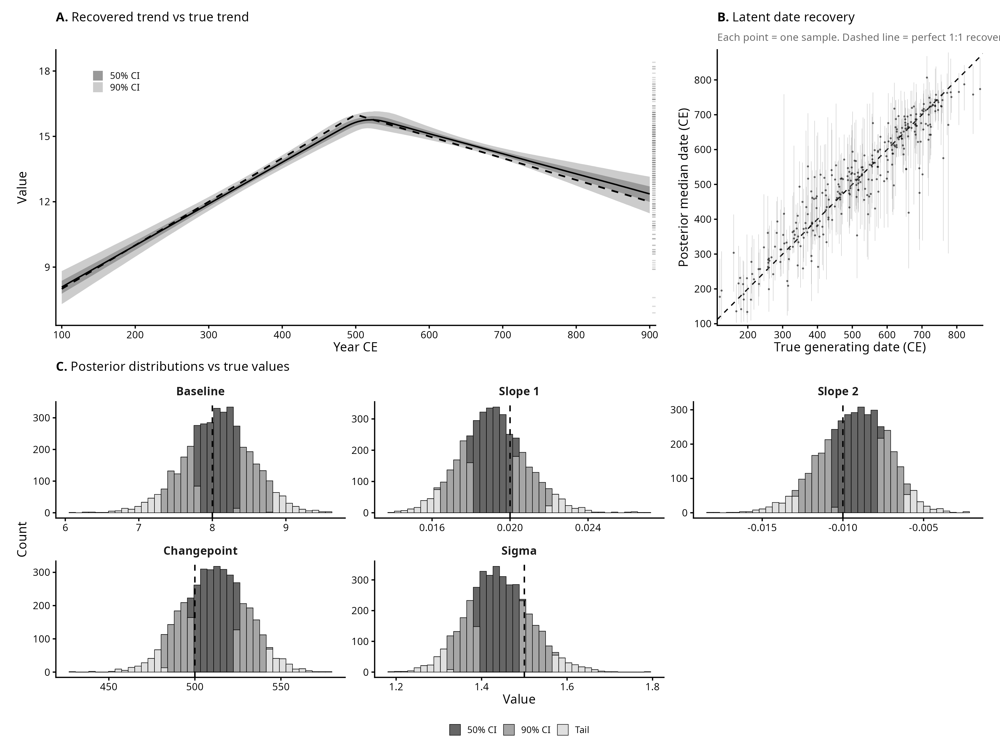
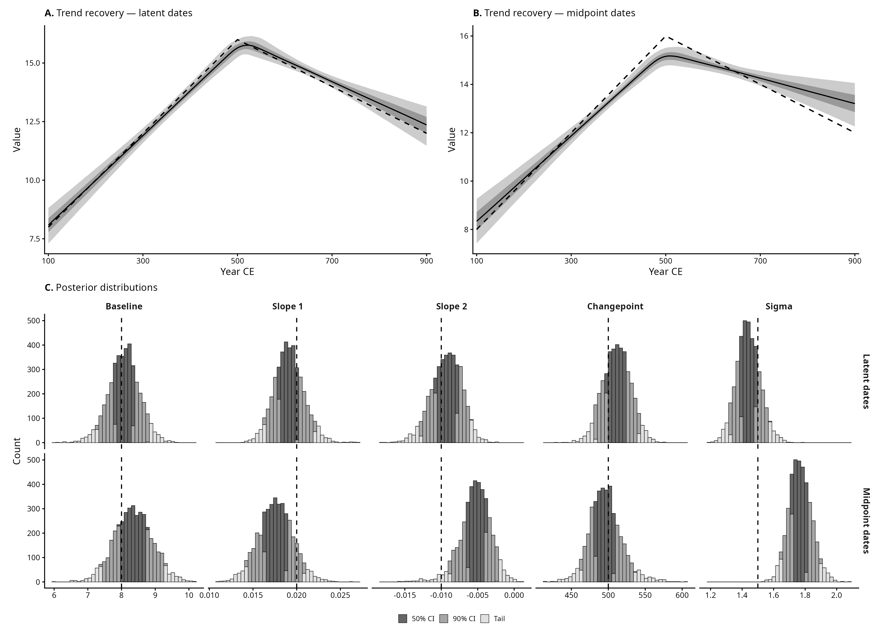
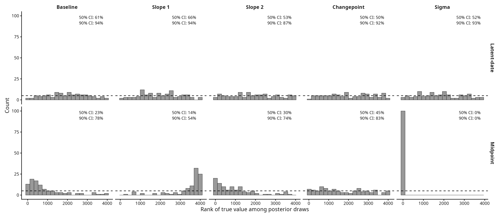

# Simulation 2: Changepoint Regression

This page shows the main findings from the simulated dataset of 300 samples of a continuous variable ranging approximately between ~7 and ~18 (Figure A). Each sample is assigned a time range with a `Start_Date` and an `End_Date`, with a known true date assigned between these boundaries (Figure B). 
The general structure of the dataset assumes an underlying piecewise-linear temporal trend with a single changepoint (Figure C):
`f(t) = baseline + slope_1 * (t - t_min)` for `t <= changepoint`
`f(t) = baseline + slope_1 * (changepoint - t_min) + slope_2 * (t - changepoint)` for `t > changepoint`

Given the simulated nature of the dataset, the goal is to verify that the model recovers the known generating parameters:

- **Baseline** = 8
- **Slope 1** = 0.02
- **Slope 2** = -0.01
- **Changepoint** = 500 CE
- **Noise** ~ N(0, 1.5)

## Exploratory panel
<p align="center">

</p>

## Model 1: Changepoint regression with latent dates

A Bayesian segmented regression with latent date inference. Each observation's true date is modelled as a uniform draw within its `[Start_date, End_date]` window. The trend is a continuous piecewise-linear function (broken-stick parameterisation):

```
mu(t) = alpha + beta1*t + (beta2 - beta1) * max(0, t - cp)
y_n ~ Normal(mu(true_date_n), sigma)
```

This is equivalent to the generating function: the function is continuous at the changepoint by construction, and `beta2 - beta1` captures the change in slope.

Panel **A** shows the recovered trend (median and 50%/90% credible intervals) against the true generating function; the rug on the right margin shows the distribution of observed values. Panel **B** is a date recovery plot: each dot is one sample, with the true generating date on the x-axis and the posterior median date on the y-axis — if recovery were perfect, all points would sit on the dashed 1:1 line; vertical bars show the 90% CI. Panel **C** shows posterior distributions for all five generating parameters, with graduated shading by credible interval and dashed lines marking the true values.

<p align="center">

</p>

## Model comparison: latent dates vs midpoint dates

A second model uses the midpoint of each sample's `[Start_date, End_date]` window as a fixed date, with no latent date inference. This is the conventional approach — treating the midpoint as the "best guess" and ignoring date uncertainty.

Panels **A–B** compare the trend recovery of both models. Panel **C** shows the posterior distributions for each generating parameter side by side (latent-date model on top, midpoint model on bottom), with graduated shading by credible interval and dashed lines marking the true values.

<p align="center">

</p>

## Simulation-based calibration (SBC)

To verify that the credible intervals are well calibrated, the simulation was repeated 100 times — each time redrawing true dates and observation noise from the same generating process while keeping the timespans fixed.

Each replication produces (for each parameter) 4,000 posterior draws. The **rank** is where the true value falls among those draws — i.e., how many of the 4,000 draws are below the true value. If the model is well calibrated, the true value is equally likely to land anywhere in the posterior, so across 100 replications the ranks should be roughly uniformly distributed. The histograms below have 20 bins, so each bin should contain about 100 / 20 = 5 replications (dashed line). A flat histogram means the model's uncertainty is honest; a histogram piled up on one side means the model is systematically wrong about that parameter.

Coverage rates for the 50% and 90% credible intervals are annotated in each panel.

<p align="center">

</p>
