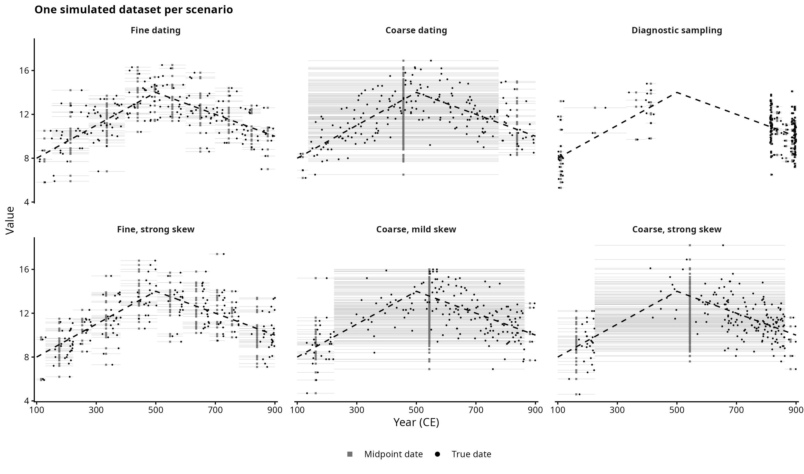
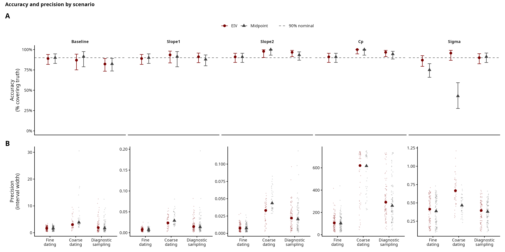
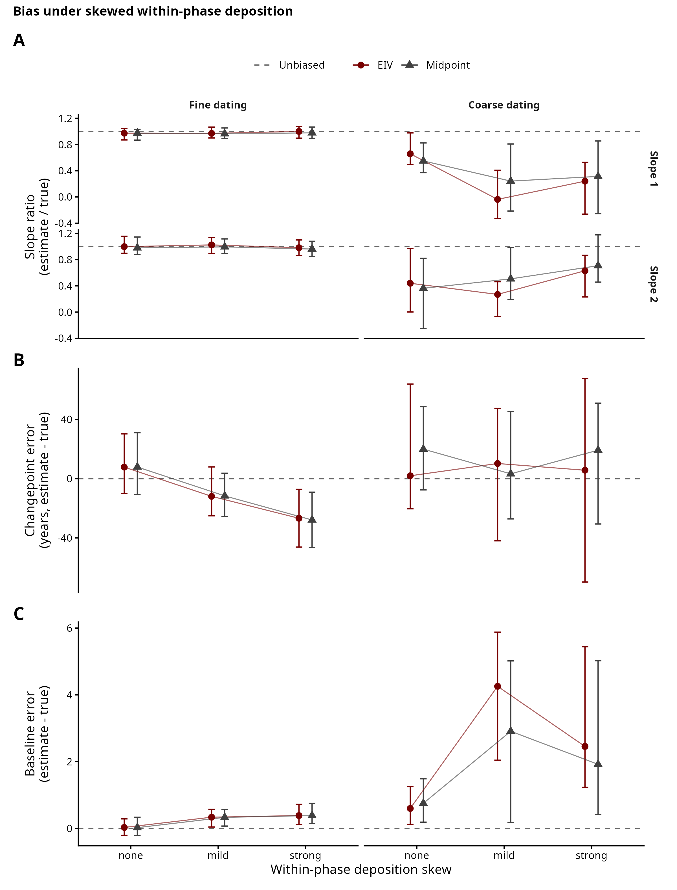
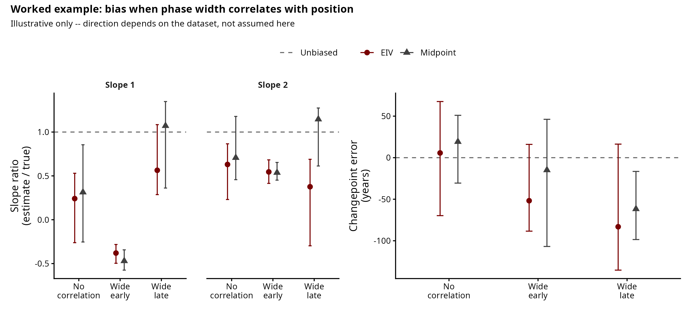
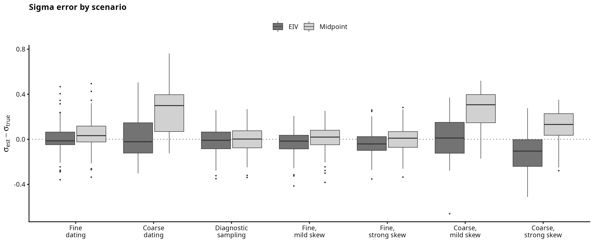

# Simulation 2: Changepoint Regression

A continuous measurement is assumed to follow a segmented temporal trend — two
straight segments meeting at a single changepoint, continuous at the join:

$$
f(t) =
\left\lbrace
\begin{array}{ll}
\text{baseline} + \text{slope}_1 (t - t_{\min}) & t \le \text{changepoint} \\
\text{baseline} + \text{slope}_1 (\text{changepoint} - t_{\min}) + \text{slope}_2 (t - \text{changepoint}) & t > \text{changepoint}
\end{array}
\right.
$$

Each observation is dated only to a phase `[Start_date, End_date]`, not to a
year. As with the linear model: does treating each date as a latent parameter
within its phase recover the trend (now two slopes meeting at a changepoint)
better than collapsing the phase to its midpoint?

From these preliminary results, EIV is consistently more precise and much
better calibrated on sigma, matching the linear story. Unlike the linear
case though, coarse dating on its own -- with no deposition skew at all --
already costs the changepoint model some slope accuracy and precision near
the kink, because widely-dated observations straddling the changepoint are
genuinely hard to assign to one side or the other.

As a single example: baseline = 8, slope_1 = 0.015, slope_2 = -0.01,
changepoint = 500 CE, noise $\sim \mathcal{N}(0, 1.5)$. The timeline is 100–900 CE, periodised
into 6 phases.

## Periodisation and dating resolution

Periodisation works as in the linear simulation: we split the timeline into
`K` phases with a Dirichlet broken stick, and each observation inherits the
`[Start_date, End_date]` of its phase, so dating uncertainty is structured,
not random. Each dataset draws its own $K \sim \mathcal{U}\{3, \ldots, 10\}$
and concentration $\alpha_{\text{conc}} = 10^{\,2 \cdot \text{Beta}(2,\, 3.5)\, -\, 1}$. Resolution is
summarised by the Shannon entropy of the phase weights,
$H = -\sum_k p_k \log p_k$: even phases give high H, one dominant phase gives
low H. The prior predictive check lives with the linear simulation
(`Sim_Linear/00_periodisation_check.R`).

## Scripts

`simulate.R` holds the shared generating process (`simulate_changepoint()`,
its `changepoint_mean()` helper, the `partition_timeline()` periodisation
helper, and constants), sourced by the worked example, the recovery study,
and the scenario study so all three use the same process. The pipeline:

| Script | Purpose | Output |
|---|---|---|
| `01_example.R` | one dataset, shown and fit with both models | `figures/exploratory_panel.png`, `model_comparison_single_fit.png`, `individual_date_posteriors.png` |
| `02_recovery_study.R` | many random plausible datasets (each its own baseline, two slopes, changepoint, noise, sample size, periodisation), both models fit, intervals recorded. Continuous sweep, not specific cases -- that's `05` below. | `output/recovery_results.csv` |
| `03_recovery_plots.R` | accuracy and precision against dating resolution (H) and against sample size (N) | `figures/accuracy_precision_composite.png`, `precision_vs_n.png`, `output/recovery_table.csv`, `recovery_width_summary.csv` |
| `04_convergence_diagnostic.R` | checks which datasets fail to converge, and whether that tracks periodisation resolution or changepoint detectability | `figures/convergence_diagnostic.png` |
| `05_scenarios.R` | nine fixed cases -- seven general-purpose (fine dating, coarse dating, diagnostic sampling, fine/coarse crossed with mild/strong within-phase deposition skew, phase width uncorrelated with position) plus two illustrative-only cases (strong skew with phase width forced early or late) -- many datasets each, both models fit; also draws one example dataset per general-purpose case | `output/scenarios.csv`, `figures/scenario_examples.png` |
| `06_scenario_plots.R` | the scenario figures | `figures/scenario_accuracy_precision.png`, `scenario_skew_bias.png`, `position_bias_example.png`, `scenario_sigma.png`, `output/scenario_table.csv` |

The example (`01`) fits in seconds; the recovery study (`02`) is 800 fits
(around 6 minutes on this machine); the scenario study (`05`) is 1800 fits
(around 14 minutes), so plotting is kept separate in both cases. Sample size
is swept across $N \in \{50, 100, 200, 400\}$. To keep every changepoint
genuine, the recovery study draws slopes as
$\text{slope}_1 \sim \mathcal{U}(-0.03, 0.03)$ and
$\text{slope}_2 = \text{slope}_1 \pm \mathcal{U}(0.01, 0.05)$ -- the slope
change is random but never negligible, so the changepoint stays
identifiable. The scenario study instead fixes both slopes and the
changepoint at the worked-example values (0.015, -0.01, 500), since its bias
metric is a ratio of estimate to true value and a true slope near zero would
make that ratio meaningless.

`02`/`03` and `05`/`06` are two different studies, not a duplicate: `02`
draws fully random datasets and shows the *continuous* relationship (as
dating resolution H or sample size N varies, how do accuracy and precision
move); `05` fixes specific, realistic cases -- including skewed deposition
and biased sampling, neither of which are in `02`. `03`'s composite figure
anchors the `fine`/`coarse`/`diagnostic` cases from `05` as vertical
reference lines on the continuous H axis, linking the two.

Six further cuts of the same H-resolved recovery relationship (`recovery.png`,
`accuracy.png`, `precision_vs_entropy.png`, `sigma_vs_entropy.png`,
`accuracy_vs_entropy.png`, `precision_boxplots.png`) were dropped from `03` as
redundant with `accuracy_precision_composite.png` and archived, code and
figures both, in
`archive/recovery_figures_trim_20260716/recovery_supplementary_figures.R`.

## Stan model: normalised time scale

Dates are mapped to $[-1, 1]$ (centred), rather than $[0, 1]$, before
fitting. Centring the covariate keeps the intercept and the two slopes from
being strongly correlated in the posterior -- the same change made to the
linear model. Re-running the recovery study after this change (same seed,
so the 800 simulated datasets are identical; only the Stan model differs)
shows a clear improvement, most visibly for `slope_2`, the segment after
the kink:

| | Old ($[0,1]$ scale) | New ($[-1,1]$ scale) |
|---|---|---|
| Slope 2, 90% accuracy (EIV) | 72.5% | 90.8% |
| Slope 2, 90% accuracy (midpoint) | 58.0% | 83.3% |
| Divergent transitions, EIV (total across 400 fits) | 3300 | 869 |
| High-Rhat fits, midpoint (max Rhat > 1.05) | 17.0% | 6.0% |

Slope 2 was the worst-calibrated parameter under the old parameterisation --
badly under-covering for both models -- and now sits almost exactly at the
90% nominal rate. Divergences for the EIV model dropped by almost four times. All
numbers quoted in the rest of this README are from the new
parameterisation. This was suggested on the Stan forum (see Linear readme).

## Exploratory panel

## Errors-in-variables (EIV) inference

The EIV model treats each true date as a latent parameter, uniform within its
phase:

$$
\begin{aligned}
\mu(t) &= \alpha + \beta_1 t + (\beta_2 - \beta_1) \max(0,\, t - \text{changepoint}) \\
y_n &\sim \mathcal{N}\!\left(\mu(t_n),\ \sigma\right)
\end{aligned}
$$

where $t_n$ is the latent true date of observation $n$.

Before the changepoint the last term is zero and the mean is $\alpha + \beta_1 t$;
after it the slope becomes $\beta_2$, the segments meeting continuously, so
$\beta_2 - \beta_1$ is the change in slope. The changepoint is a free parameter with a
flat prior over the normalised time range, fit jointly; its true value (500 CE) is
only used afterwards to check recovery.

Left panels: the recovered trend with a sample's phase (shaded) and value
(dashed). Right panels: each date's posterior, with the phase boundaries (dashed)
and the true date (solid). Observations in a long phase stay broadly uncertain --
the model does not invent precision it lacks.

## Model comparison on a single dataset

The midpoint model fixes each date at the centre of its phase. On a single
dataset both recover the trend, but the midpoint returns a larger sigma:
the within-phase date spread it ignores ends up in the residual. Near the
changepoint the midpoint's trend also lags and smooths through the kink,
since the midpoints of phases straddling the kink stay fixed at their
centres regardless of which side of the changepoint the true dates actually
fall on.

## Recovery study

One dataset can't rule out lucky parameters, so the study draws many --
each with its own baseline, two slopes, changepoint, noise, sample size,
and periodisation. Both models are fit to all of them, recording how often
the 50% / 90% interval holds the truth (accuracy) and how wide it is
(precision). The changepoint posterior is harder to sample than the linear
one, so about a fifth of fits get dropped for non-convergence (max Rhat >
1.05 or divergences; EIV 20.8%, midpoint 17.0% -- see
`04_convergence_diagnostic.R` below). Accuracy is essentially unchanged
with or without this filter.

| Parameter | Interval | EIV | Midpoint |
|---|---|---|---|
| Baseline | 50% | 48.3% | 59.0% |
| Baseline | 90% | 91.2% | 95.8% |
| Slope 1 | 50% | 48.3% | 54.2% |
| Slope 1 | 90% | 89.9% | 94.0% |
| Slope 2 | 50% | 45.7% | 44.9% |
| Slope 2 | 90% | 90.2% | 82.8% |
| Changepoint | 50% | 48.9% | 56.3% |
| Changepoint | 90% | 89.9% | 89.8% |
| Sigma | 50% | 49.8% | 9.6% |
| Sigma | 90% | **90.2%** | **26.8%** |

Both models recover the baseline, first slope, and changepoint location at
near-nominal accuracy. They diverge in two places:

1. **Precision.** Comparing median interval widths paired by dataset
   (`recovery_width_summary.csv`), EIV's interval is 34-44% narrower for
   the baseline and both slopes, and 36% narrower for the changepoint,
   since the midpoint throws away the within-phase spread that constrains
   the trend. For sigma the two are about the same width -- EIV's is 0.2%
   *wider* -- which only matters together with the next point.
2. **Sigma.** The midpoint reads the within-phase date spread as noise and
   overestimates it, so its 90% interval holds the true sigma only 26.8%
   of the time against 90.2% for EIV -- similar widths, wildly different
   accuracy, because the midpoint's sigma estimates are simply biased high
   rather than merely uncertain.

Slope 2 (the post-changepoint segment) now sits at nominal accuracy for EIV
(90.2%) and close to it for the midpoint (82.8%) -- mostly thanks to the
$[-1,1]$ rewrite above. Precision improves with sample size for both
models, as expected.

### Accuracy and precision against dating resolution

Does the 90% interval hold the truth (panel A) and, if so, how wide is it
(panel B), as the periodisation changes from coarse (low H) to fine (high
H)? The dotted vertical lines mark where the `fine`, `coarse`, and
`diagnostic` cases from the scenario study (below) sit on this same
spectrum.

Baseline and Slope 1 sit close to nominal across the entropy range for both
models. Slope 2 and the changepoint are noisier at low H (few datasets
there converge at all -- see below) but recover the same near-nominal
accuracy by mid-to-high H. Sigma is where the two models separate cleanly:
EIV holds close to 90% throughout, while the midpoint's accuracy degrades
sharply toward low H, exactly where the within-phase spread it ignores is
largest.

### Further checks #1: Sample size

Both models show a steady improvement in precision as sample size increases.

### Further checks #2: Convergence

The changepoint posterior is harder to sample than the linear one. Since
some fits don't converge, `04_convergence_diagnostic.R` checks whether the
dropped fits are weak-signal cases or just hard geometries: detectability
is a kink/noise ratio (the slope change times the distance from the
changepoint to the nearer data edge, over sigma -- a sharp bend away from
the edges is easy to see, wide scatter hides it). Non-convergence tracks
the periodisation resolution -- coarse periodisations (low H, one long
phase) converge far less often (57% in the lowest-H quartile, rising to
95% in the highest) -- much more strongly than it tracks a weak kink
(roughly 72-90% for EIV and 77-92% for the midpoint across the
detectability range, with no clear trend). So the fits dropped by the
convergence filter above are not simply a biased sample of the weakest
changepoints.

## Scenario study

The recovery study draws fully random datasets and shows the general
relationship; `05_scenarios.R` fixes nine archetype cases instead, so the
"when does EIV matter" question has clean, quotable numbers per case.
Baseline and sigma stay random nuisance draws in every case; the two
slopes and the changepoint are fixed at the worked-example values (0.015,
-0.01, 500) so the ratio-based bias metrics below stay meaningful.

There are three separate things about the dating that could go wrong:

- **Fine dating** / **Coarse dating**: how finely the timeline is
  periodised. In the linear model this only changes precision, not bias.
  In the changepoint model it turns out to also matter for accuracy near
  the kink (see below) -- coarse phases straddling the changepoint make it
  genuinely harder to tell which side an observation belongs to.
- **Diagnostic sampling**: which phases the samples come from -- narrow,
  well-dated phases over-sampled, simulating a good typochronological
  phase.
- **Skewed deposition** (`fine_mild`/`fine_strong`/`coarse_mild`/`coarse_strong`):
  where within a phase the dates actually sit.

As in the recovery study, `06_scenario_plots.R` filters to converged fits
(max Rhat ≤ 1.05, no divergences) before computing every number below. This
filter bites hardest on the coarse cases -- `n_fit` in `scenario_table.csv`
is only 34-46/100 for `coarse`, `coarse_mild`, `coarse_strong` (EIV) and
27-35/100 (midpoint), against roughly 90-100/100 for the fine and
diagnostic cases -- so the coarse-case numbers describe the subset of
datasets whose posterior happened to converge, not all 100 replicates.
Where this matters for a specific claim below (the coarse Slope 1 ratio),
we checked it against the full unfiltered set and it holds; we have not
re-checked every number in this section that way.

Six of the seven general-purpose cases as datasets, one draw each with the
worked-example parameters (`fine_mild` is left out of the gallery for the
same reason as in the linear study -- it looks near-identical to `fine
dating`/`fine, strong skew` and adds no visible information, though it is
still fit and reported below). True dates are dots, midpoints squares:

### Fine, coarse, diagnostic

Unlike the linear case, coarse dating alone is not bias-neutral here: even
with no deposition skew, the `coarse` case's Slope 1 ratio (posterior
median / true slope) is 0.66 for EIV against 0.97 under `fine` -- a real
flattening toward zero, not just wider uncertainty. Accuracy does not
reveal this on its own (both models still hold 90-93% of their 90%
intervals over the truth, because the intervals widen enough to keep
catching it), which is why the ratio, not the accuracy rate, is the number
to read here. This ratio is essentially unchanged (0.58 for EIV) if
computed on all 100 raw replicates from `scenarios.csv` instead of only the
ones that converged (see the convergence caveat above), so the effect
isn't an artifact of which fits survived the convergence filter. Precision
costs are also steep under coarse dating: Slope 1's interval is about 23%
narrower for EIV than midpoint (0.026 vs 0.034) and the changepoint's is
about 8% narrower (504 vs 550 years). Sigma repeats the recovery-study
pattern at case level: EIV's 90% interval holds the true sigma 95.7% of
the time under coarse dating against 42.9% for the midpoint
(`scenario_table.csv`).

### Skewed deposition

Panel A: the slope ratio (posterior median / true slope), faceted by phase
width, for the four general-purpose skew cases (phase width uncorrelated
with timeline position). On fine phases both slope ratios stay pinned near
1 regardless of skew strength, matching the linear result. On coarse
phases the ratios are already well below 1 with no skew at all
(`coarse`'s own Slope 1 ratio is 0.66, EIV) and stay depressed and noisy
as skew increases -- consistent with the coarse-dating effect noted above
rather than skew being the driver. Panel B: the changepoint's own bias, in
years rather than a ratio (a location near 500 has no natural "unbiased
ratio"). It stays small and centred near zero on fine phases and grows
noisier, but not systematically signed, on coarse ones.

### Worked example: phase width correlated with position

As in the linear study, this isn't a general claim -- whether coarse
phases cluster early or late on a real timeline depends on which periods
happen to be well-typologised. With wide phases forced early, both slopes
are pulled toward zero or past it for both models (Slope 1 ratio EIV
-0.38, midpoint -0.47) and the changepoint is pulled substantially earlier
(EIV -52 years, midpoint -15). With wide phases forced late, the picture
flips in direction but not in the general lesson: EIV stays closer to
unbiased on Slope 1 (0.56 vs midpoint's 1.07, an overshoot past the truth)
while both push the changepoint later than true (EIV -83, midpoint -62
years -- both still negative here because the changepoint estimate lags
behind where the worked-example kink actually sits once phase width
correlates with position). Neither model reliably defends against this
correlation; it's a property of the periodisation, not something a free
date parameter alone can fix.

Re: sigma, it keeps the same pattern as the recovery study across every
case: EIV's interval holds the truth far more often than the midpoint's,
and the gap widens as phases coarsen.

### Final thoughts

The $[-1,1]$ rewrite fixed the worst calibration problem in the old model
(Slope 2 accuracy) without changing the qualitative story: EIV is
consistently more precise and much better calibrated on sigma, and neither
model is immune to bias from coarse, position-correlated periodisations.
What's new relative to the linear simulation is that coarse dating alone --
without any deposition skew -- already costs the changepoint model some
slope accuracy and precision near the kink, because widely-dated
observations straddling the changepoint are genuinely hard to assign to
one side or the other. Before trusting a changepoint estimate on a real
periodisation, both the general recovery-study caveat (coarser dating
lowers accuracy near the kink) and the linear study's caveat (check
whether phase width correlates with phase position) apply.
