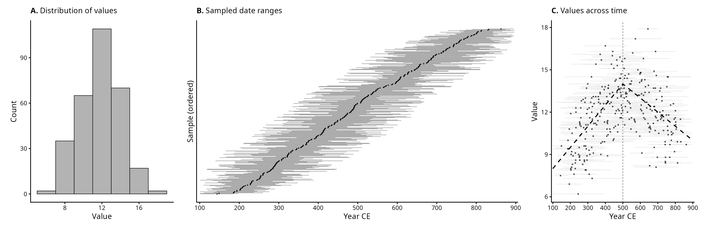
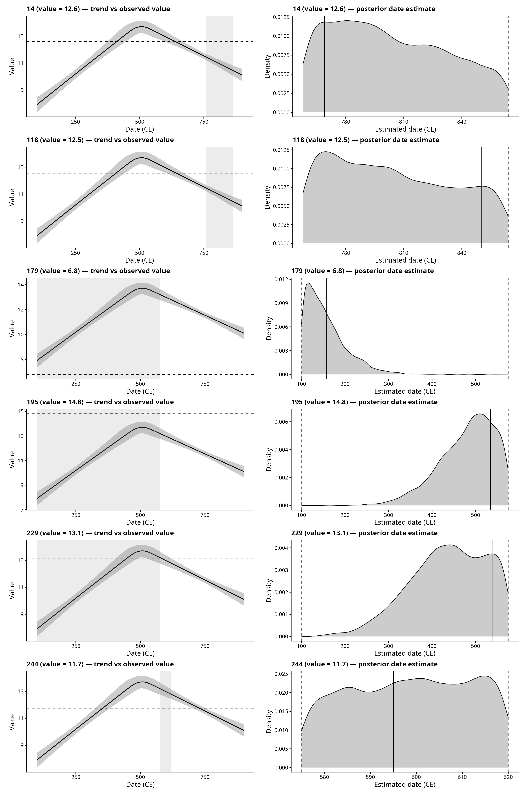
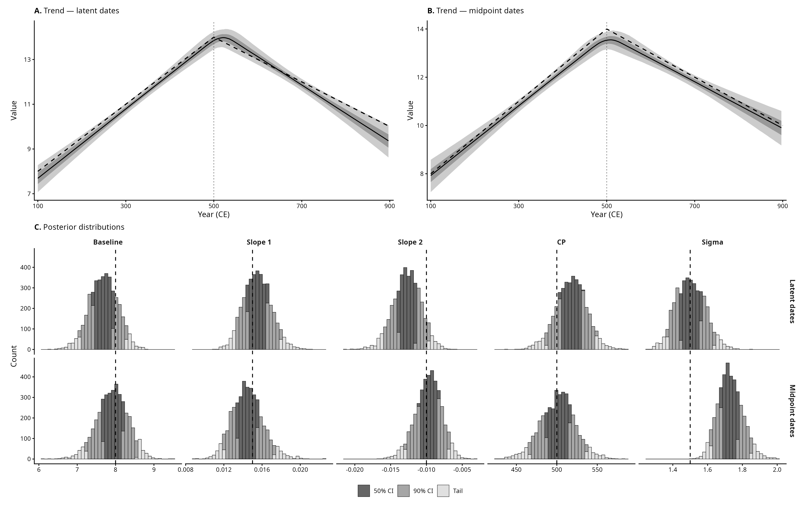
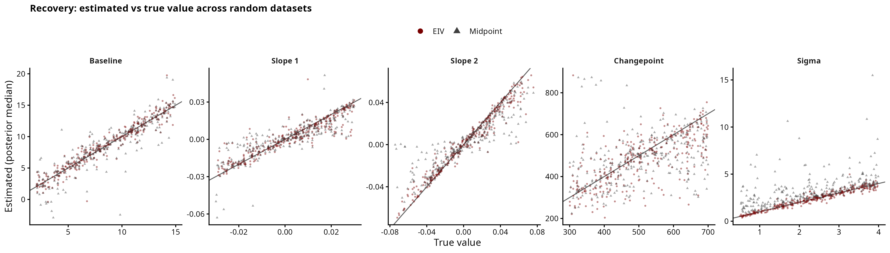
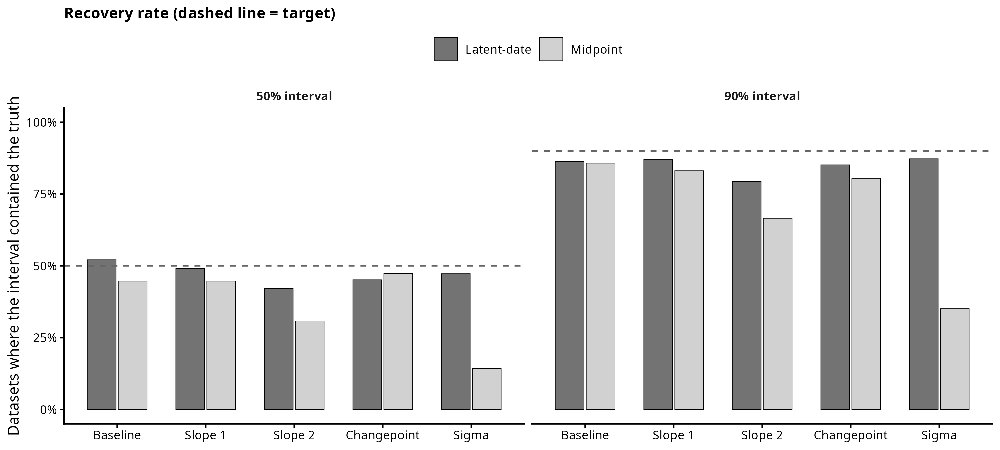
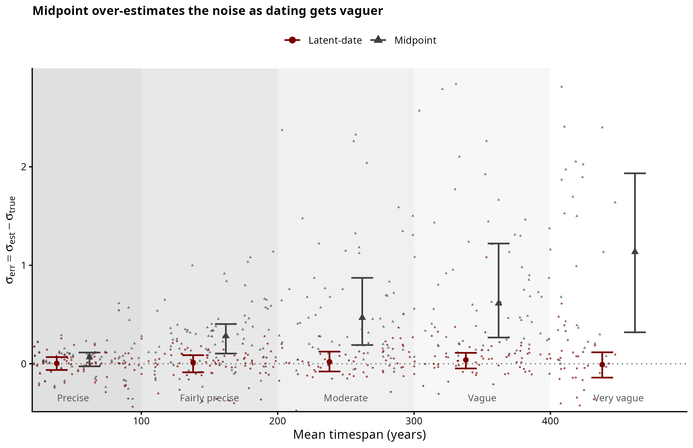
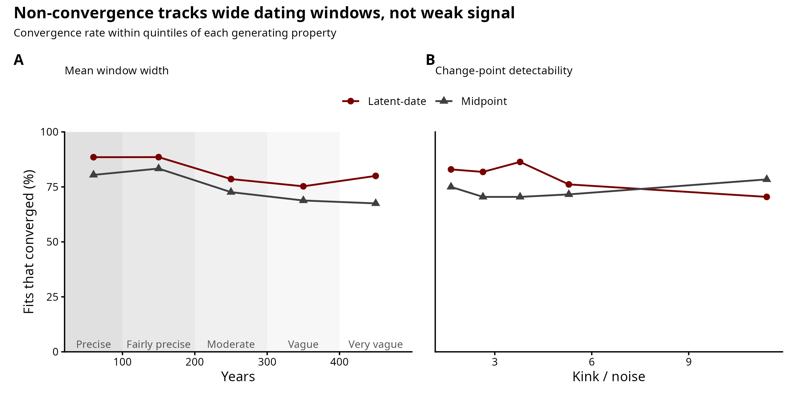

# Simulation 2: Changepoint Regression

A continuous measurement is assumed to follow a segmented temporal trend — two
straight segments meeting at a single changepoint, continuous at the join:

```
f(t) = baseline + slope_1 * (t - t_min)                              for t <= changepoint
f(t) = baseline + slope_1 * (changepoint - t_min) + slope_2 * (t - changepoint) for t > changepoint
```

Each observation carries a dating range `[Start_date, End_date]` (of varying
width) rather than a known year. The question is whether treating each date as a
latent parameter within its range recovers the trend better than collapsing the
range to its midpoint.

Generating parameters (worked example): **baseline = 8**, **slope_1 = 0.015**,
**slope_2 = -0.01**, **changepoint = 500 CE**, **noise ~ N(0, 1.5)**.

## Scripts

`simulate.R` holds the shared generating process (the `simulate_changepoint()`
function and constants); it is sourced by both the worked example and the study,
so the two provably use the same process. The pipeline is then three scripts:

| Script | Purpose | Output |
|---|---|---|
| `01_example.R` | draw ONE dataset, show it, fit both models, compare | `figures/exploratory_panel.png`, `model_comparison_single_fit.png`, `individual_date_posteriors.png` |
| `02_recovery_study.R` | draw MANY random plausible datasets (each with its own baseline, two slopes, changepoint, noise, sample size, mixed windows), fit both models, record whether each interval contains the truth | `output/recovery_results.csv` |
| `03_recovery_plots.R` | the study figures | `figures/recovery.png`, `coverage.png`, `sigma_vs_window.png` |
| `04_convergence_diagnostic.R` | inspect which datasets fail to converge, contrasting dating-window width with changepoint detectability | `figures/convergence_diagnostic.png` |

The worked example (`01`) fits in seconds, so it is self-contained. The study
(`02`) takes about 11 minutes (800 fits), so its plotting (`03`) is kept separate
— figures can be restyled without refitting. So that every dataset poses a genuine
changepoint problem, the two slopes are drawn as `slope_1 ~ U(-0.03, 0.03)` and
`slope_2 = slope_1 ± U(0.01, 0.05)`: the slope change is random over a range but
never negligible, which keeps the changepoint identifiable.

## Exploratory panel
<p align="center">

</p>

## Latent-date inference

The latent-date model treats each observation's true date as an unknown
parameter, uniform within its `[Start_date, End_date]` window:

```
mu(t) = alpha + beta1*t + (beta2 - beta1) * max(0, t - changepoint)
y_n ~ Normal(mu(true_date_n), sigma)
```

Before the changepoint `max(0, t - changepoint) = 0` and the mean reduces to
`alpha + beta1*t`; after it the slope shifts to `beta2`, the two segments meeting
continuously at the changepoint, so `beta2 - beta1` is the change in slope. The
changepoint itself is a free parameter with a uniform prior over the time range,
sampled jointly with everything else; the true value (500 CE) is only used
afterwards to check recovery.

For a sample of observations, the left panels show the recovered trend with the
sample's date range (shaded) and observed value (dashed); the right panels show
the posterior for each estimated date, with the range boundaries (dashed) and the
true generating date (solid). Wide-window dates stay broadly uncertain — the model
correctly declines to invent precision it does not have.

<p align="center">

</p>

## Model comparison on a single dataset

The midpoint model fixes each date at the midpoint of its range. On one dataset
both approaches recover the trend within the 90% credible interval, but the
midpoint model returns a larger sigma, because unmodelled date uncertainty is
absorbed into the residual variance.

<p align="center">

</p>

## Recovery study

A single dataset tests the method at one point and cannot rule out a favourable
choice of parameters. Instead the study simulates many random plausible datasets:
each draws its own baseline, two slopes, changepoint location, noise level, sample
size, and a realistic mix of dating-window widths. Both models are fit to every
dataset, and we count how often each 50% / 90% credible interval contains the true
value. The changepoint posterior is harder to sample than the linear one, so about
a fifth of fits are dropped for non-convergence (max Rhat > 1.05 or divergences);
the coverage rates are essentially unchanged whether or not this filter is applied.

Two extra checks are tracked for the difficult changepoint case. First,
`sigma_vs_window.png` shows that the midpoint model increasingly overestimates the
generative noise scale as dating windows widen, while the latent-date model stays
close to unbiased. Second, `convergence_diagnostic.png` asks whether dropped fits
look like weak-signal cases or simply hard posterior geometries: in these
simulations, non-convergence is more strongly associated with wide dating windows
than with low changepoint detectability, so the discarded fits are not just the
datasets with the faintest kink.

**Findings.** Both models recover the baseline, the first slope, and the
changepoint location at close to the nominal rates. They diverge in two places.
First, as in the linear case, the noise level sigma: the midpoint absorbs dating
uncertainty into the residual and overestimates sigma, and the error grows as a
dataset's dating becomes vaguer, while the latent-date model recovers sigma
whatever the dating precision (see `sigma_vs_window.png`). Second, the
post-changepoint slope `slope_2` is mildly under-covered even by the latent model
(about 79% at the 90% level) and noticeably worse under the midpoint model (about
67%) — the segment after the changepoint rests on fewer observations and is
entangled with the changepoint location, so it is the hardest parameter to pin
down, and ignoring date uncertainty makes it harder still.

<p align="center">




</p>
