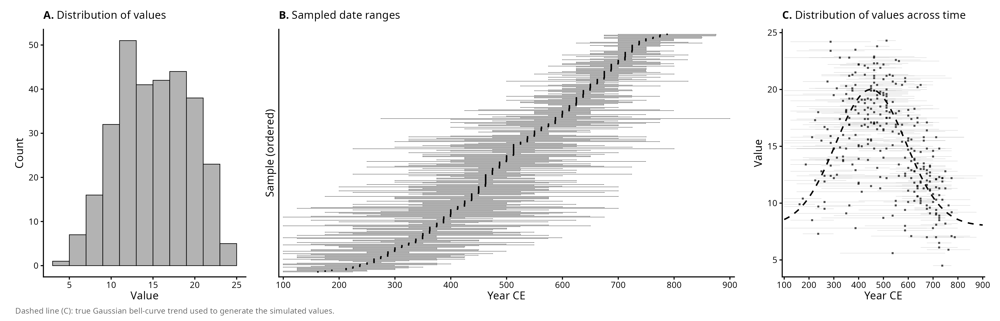
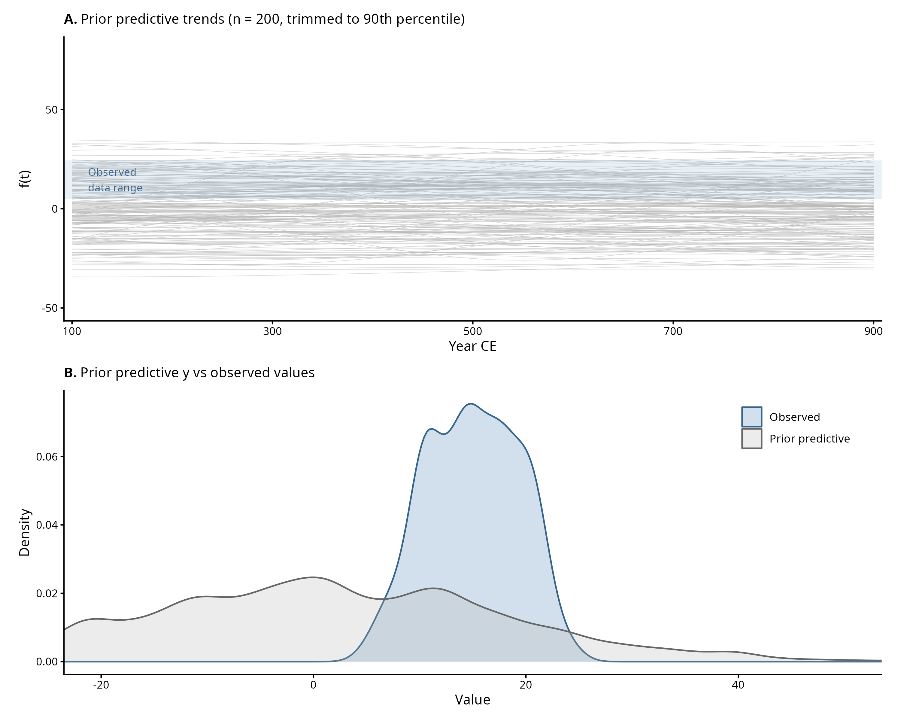
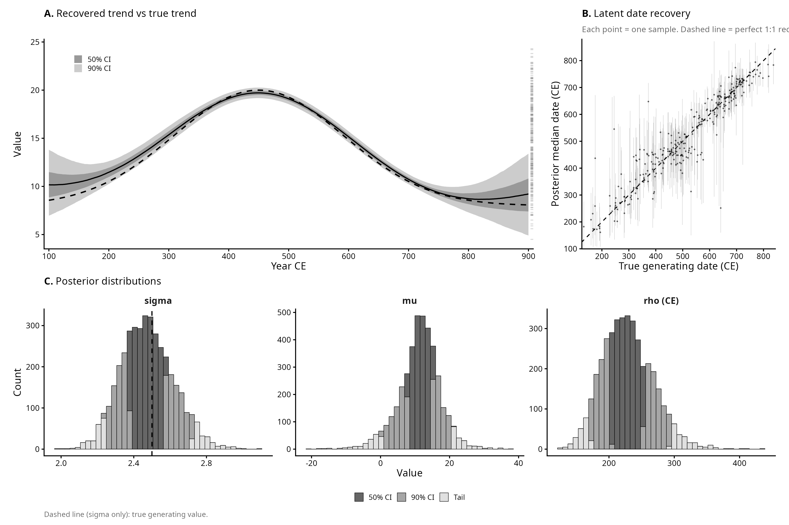
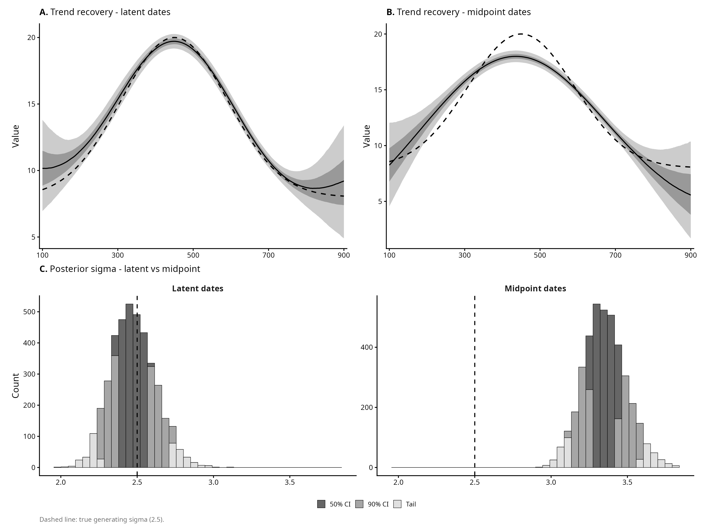
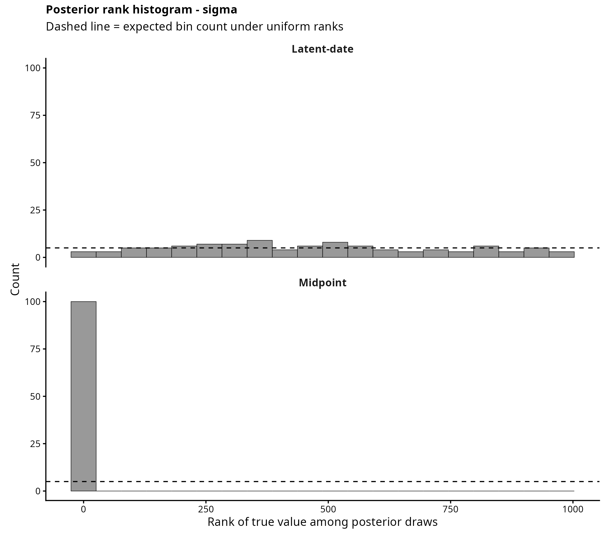

# Simulation 3: Gaussian Process

A continuous measurement is assumed to follow a smooth bell-shaped temporal
trend,

```
f(t) = baseline + amplitude * exp(-((t - peak) / width)^2)
```

observed with Gaussian noise. Each observation carries a dating range
`[Start_date, End_date]` rather than a known year. The question is whether
treating each date as a latent parameter within its range recovers the smooth
trend better than collapsing the range to its midpoint.

Generating parameters (worked example): **baseline = 8**, **amplitude = 12**,
**peak = 450 CE**, **width = 200**, **noise ~ N(0, 2.5)**.

Because the fitted model is non-parametric, the GP is not judged by recovering
those named generator parameters one-for-one. Instead the key checks are whether
it recovers the true curve, simple curve features such as the peak, and the
known residual noise scale.

## Scripts

`simulate.R` holds the shared generating process (the true bell-shaped curve,
date-window generator, and truth tables); it is sourced by both the worked
example and the repeated study, so they provably use the same process. The
pipeline is then four scripts:

| Script | Purpose | Output |
|---|---|---|
| `01_example.R` | draw ONE dataset, show it, fit both models, compare | `figures/exploratory_panel.png`, `model_results_panel.png`, `model_comparison.png` |
| `02_recovery_study.R` | redraw true dates and noise many times on the same fixed date windows, fit both models, record sigma calibration summaries, and also write a sigma recovery table for inspection | `output/calibration_results.csv`, `output/calibration_results_midpoint.csv`, `output/recovery_results.csv`, `output/runtime_summary.csv` |
| `03_recovery_plots.R` | the repeated-study figure | `figures/calibration_coverage.png` |
| `04_prior_predictive_check.R` | draw from the HSGP priors and compare the implied trends and values with the observed range | `figures/prior_predictive_check.png` |

The worked example (`01`) writes the single simulated dataset and all
single-dataset figures. The repeated study (`02`) is kept separate because it is
the expensive step; its plotting (`03`) can then be restyled without refitting.
That repeated study also writes `output/recovery_results.csv`, but the current
paper-level combined sigma-vs-window figure excludes GP because the GP study is
a fixed-window calibration design, not a varying-window recovery design like the
linear and changepoint simulations. The prior predictive check (`04`) is
separate because it is about the priors, not about recovery from one realised
dataset.

## Exploratory panel
<p align="center">

</p>

## Prior predictive check

Before fitting any data, 200 parameter sets were drawn from the priors and GP realisations were generated through the HSGP parameterisation. Panel **A** shows the resulting trend curves (trimmed to the 90th percentile by absolute magnitude for legibility); the blue band marks the observed data range. Panel **B** compares the density of prior predictive observations against the actual observed values. The priors are intentionally wide — they should cover the data range without being tightly centred on it.

<p align="center">

</p>

## Model 1: HSGP regression with latent date inference

A Hilbert-space GP regression with latent date inference. Each observation's true date is modelled as a uniform draw within its `[Start_date, End_date]` window, and the trend is approximated via a low-rank basis expansion of a squared-exponential GP:

```
f(t) = mu + PHI(t)' * beta
y_n  ~ Normal(f(true_date_n), sigma)
```

Panel **A** shows the recovered trend (median and 50%/90% credible intervals) against the true Gaussian bell curve used to generate the data (dashed). Panel **B** is a date recovery plot: each dot is one sample, with the true generating date on the x-axis and the posterior median on the y-axis — vertical bars are 90% CIs. Panel **C** shows posterior distributions for sigma (dashed line marks the true generating value), the GP mean mu, and the GP length-scale rho in original time units; mu and rho do not have simple true values since they are inferred non-parametric properties of the fitted curve.

<p align="center">

</p>

## Model comparison: latent dates vs midpoint dates

A second model fixes each observation's date at the midpoint of its `[Start_date, End_date]` window and runs the same HSGP regression on those fixed dates, ignoring temporal uncertainty entirely.

Panels **A–B** compare trend recovery between the two models. Panel **C** shows the posterior for sigma under each model, with the true generating value (2.5) marked by a dashed line. The midpoint model places its sigma posterior noticeably above 2.5 because unmodelled date uncertainty is absorbed into the residual variance — the same pattern seen in the linear and changepoint simulations.

<p align="center">

</p>

## Repeated study

For the GP case, the repeated study is a calibration check rather than a
parameter-recovery table. The simulation is repeated many times, each time
redrawing true dates and observation noise from the same generating process
while keeping the date windows fixed. Sigma is the cleanest scalar target
because it has a known true value (2.5), and it also links directly to the
linear and changepoint simulations. This means the GP repeated study answers a
different question from the combined sigma-vs-window figure: it checks whether
the latent-date GP is calibrated under one fixed window structure, not how
performance changes across a range of average dating-window widths.

Under a well-calibrated model the true sigma should be equally likely to land
anywhere in the posterior, so posterior ranks across replications should be
roughly uniform. A histogram piled up on the right means the model
systematically underestimates sigma; a histogram piled up on the left means it
systematically overestimates it. The midpoint model is expected to distort sigma
because unmodelled date uncertainty is absorbed into the residual variance.

In the current 100-run study, the latent-date GP passes this calibration check
reasonably well for the fixed-window design. Its empirical sigma coverage was
56% for the nominal 50% interval and 94% for the nominal 90% interval, with no
fit errors, no divergent transitions, median max R-hat 1.004, and worst max
R-hat 1.069 across the 100 fits. That makes the calibration-coverage figure
methodologically sound as a GP-specific fixed-design check. By contrast, the
midpoint GP is clearly miscalibrated: its sigma posterior is shifted upward and
the true sigma was inside neither the 50% nor the 90% interval in this 100-run
study.

<p align="center">

</p>
