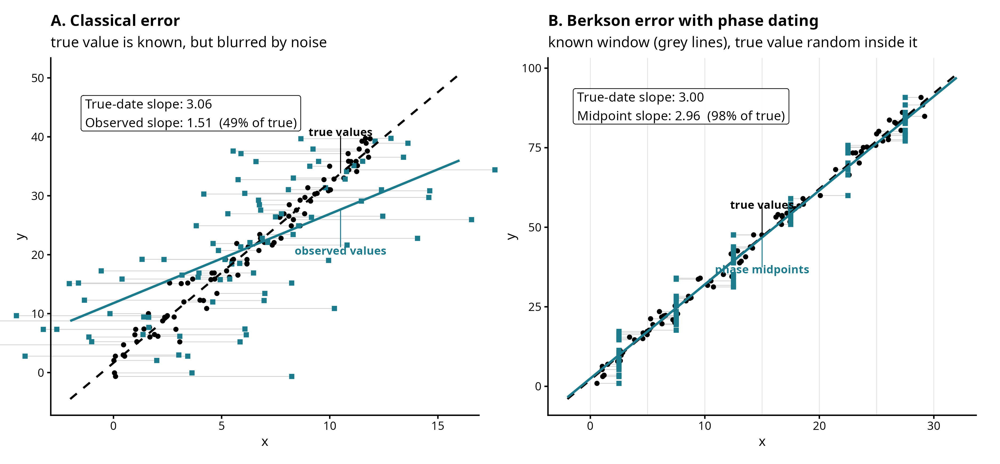
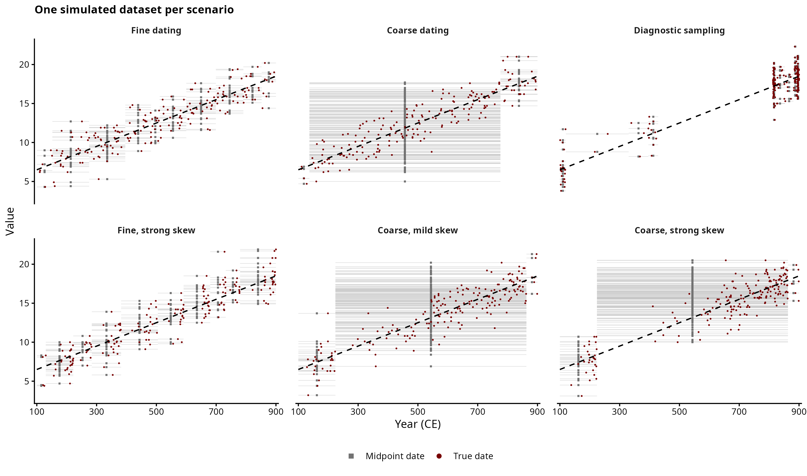
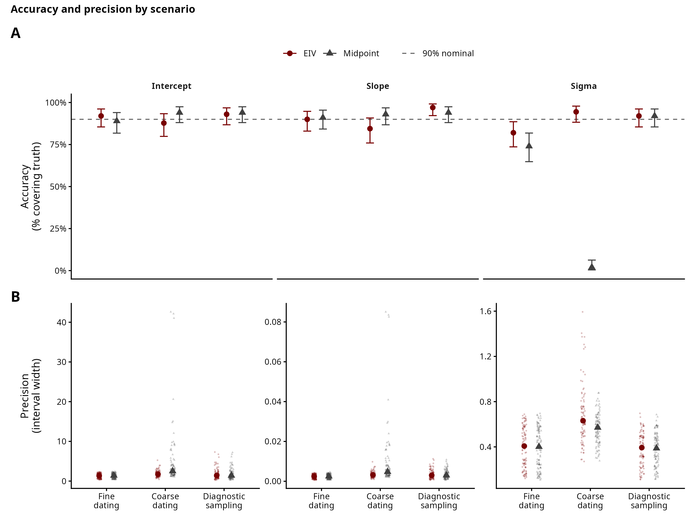
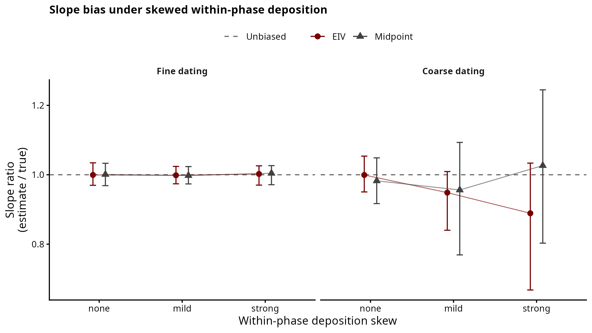
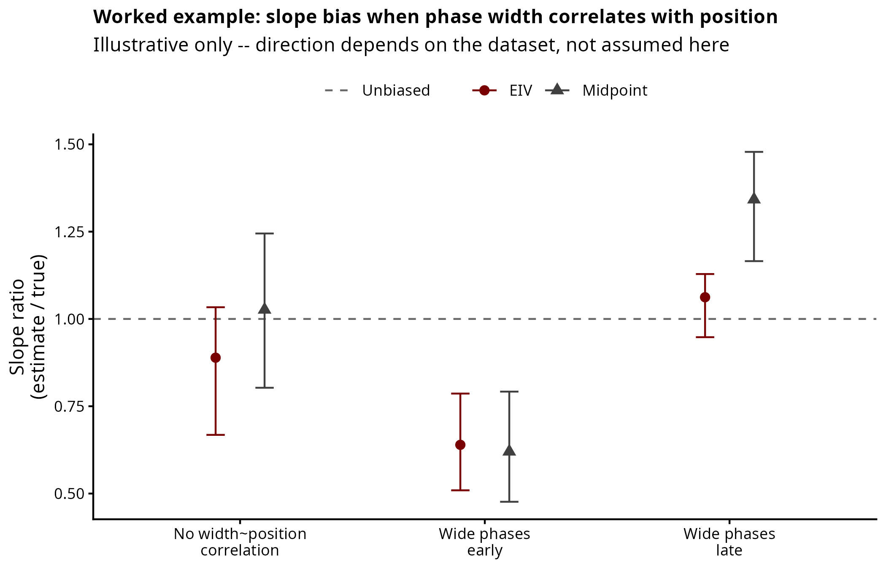
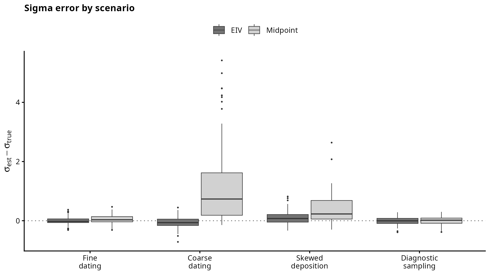

# Simulation 1: Linear Regression

A continuous measurement is assumed to follow a linear temporal trend
$f(t) = \text{baseline} + \text{slope} \cdot t$, observed with Gaussian noise. Each observation is
dated only to a phase with `[Start_date, End_date]` rather than to a known year. Does treating each date as a latent parameter within its phase recover the trend better than collapsing the phase to its midpoint?

From these preliminary results, the EIV and midpoint models agree on the trend (Berkson-like error) when deposition is uniform within a phase. The EIV model's interval is narrower at the same accuracy, and its noise estimate (sigma) is both closer to the truth and much better calibrated than the midpoint's.

If we skew deposition within a phase (with more dates towards one edge rather than evenly), the intercept slightly shifts rather than producing a biased trend. The trend only becomes biased when that skew is combined with phase width correlating with position on the timeline (wide, coarsely-dated phases clustered at one end rather than scattered randomly), and even then the EIV model is not reliably better at recovering the trend than the midpoint model. What is different is that the EIV model allows calibrated uncertainty and per-sample date posteriors, although it does not reliably correct a biased trend. One possible approach would be providing an informative within-phase prior derived from external knowledge (C14 dates, stratigraphy, etc).

Turning to a single example, we generate a dataset with known parameters: baseline = 5, slope = 0.015,
noise $\sim \mathcal{N}(0, 1.5)$. The timeline where the samples are located in this dataset is 100–900 CE (although the model works also on negative dates; BCE). 

We divide the timeline into three uneven phases, with one phase covering more than half of the time range (a coarse periodisation). When phases are narrow the two models mostly agree, so we choose a coarse periodisation to show differences between two models. 

## Periodisation and dating resolution

As common in archaeological relative dating, we assume that samples are associated with a particular phase ("The sample X belongs to phase Y, which has a known duration `[Start_date, End_date]`"). To partition the timeline into `K` phases, we use a Dirichlet broken stick (as in [Crema's beyond aoristic paper](https://github.com/ercrema/beyond_aoristic/blob/v1.0.0/src/diristick.R)), and every
observation is assigned the `[Start_date, End_date]` of the phase its true date
falls in. 

We do this because observations in the same phase share an identical window (and identical time boundaries), so that the dating uncertainty is structured rather than random (as would be the case instead for a radiocarbon date). 
Each dataset draws its own number of phases ($K \sim \mathcal{U}\{3, \ldots, 10\}$) and Dirichlet concentration
($\alpha_{\text{conc}} = 10^{\,2 \cdot \text{Beta}(2,\, 3.5)\, -\, 1}$)[1], which could result either in few even phases or one long phase dominating others in the range. 

The resolution of a periodisation is summarised by the Shannon entropy of the
phase weights, $H = -\sum_k p_k \log p_k$. Even phases have high H (the
ceiling is about 2.3 for ten equal phases), whereas one dominant phase would have instead low H. We also run a
prior-predictive check located in `00_periodisation_check.R`.

*[1] With Beta(2, 3.5) the distribution leans toward low concentrations (coarser, lower-H periodisations). alpha_conc is 10 exponentiated to this Beta so that we get values that are between 0 and 10, but the mass is placed more towards coarser phases.*

## Simulation scripts

`simulate.R` contains the shared generating process `simulate_linear()`, the
`partition_timeline()` helper (note to self: might move this to a separate file), and the timeline constants — sourced by the
example and the study so they use the same process.

| Script | Purpose | Output |
|---|---|---|
| `00_periodisation_check.R` | prior predictive check: draw the priors, simulate datasets, show H, example phases, and the values they imply | `figures/periodisation_H_distribution.png`, `periodisation_examples.png`, `prior_predictive.png` |
| `01_example.R` | one dataset, shown and fit with both models | `figures/exploratory_panel.png`, `model_comparison_single_fit.png`, `individual_date_posteriors.png` |
| `02_recovery_study.R` | many random datasets (each its own intercept, slope, noise, sample size, periodisation), always uniform deposition; both models fit, intervals recorded. Continuous sweep, not specific cases -- that's `05` below. | `output/recovery_results.csv` |
| `03_recovery_plots.R` | accuracy and precision against dating resolution (H) and against sample size (N) | `figures/accuracy_precision_composite.png`, `precision_vs_n.png`, `output/recovery_table.csv`, `recovery_width_summary.csv` |
| `05_scenarios.R` | nine fixed cases -- seven general-purpose (fine dating, coarse dating, diagnostic sampling, fine/coarse crossed with mild/strong within-phase deposition skew, phase width uncorrelated with position) plus two illustrative-only cases (strong skew with phase width forced early or late) -- many datasets each, both models fit; also draws one example dataset per general-purpose case | `output/scenarios.csv`, `figures/scenario_examples.png` |
| `06_scenario_plots.R` | the scenario figures | `figures/scenario_accuracy_precision.png`, `scenario_skew_bias.png`, `position_bias_example.png`, `scenario_sigma.png`, `output/scenario_table.csv` |
| `07_berkson_vs_classical.R` | just for self-teaching: classical vs Berkson measurement error, side by side, to show why the slope ties between models under uniform deposition | `figures/berkson_vs_classical.png` |

The example (`01`) fits in less than a minute; the study (`02`) takes a few minutes (around 10 circa), so
plotting (`03`) is kept separate and figures can be restyled without refitting. The Stan model design benefited from [this discussion on the Stan forum](https://discourse.mc-stan.org/t/eiv-model-of-temporal-trend-with-berkson-like-error/41435/2), which improved the speed (using vectorization and changing the uniform distribution of date_norm to -1,1).
Sample size is swept across $N \in \{50, 100, 200, 400\}$ to read precision against N.

`02`/`03` and `05`/`06` are two different studies: `02` draws fully random datasets
under uniform deposition only, so it shows the *continuous* relationship (as dating resolution H or
sample size N varies, how do accuracy and precision move); `05` fixes specific, realistic cases,
including skewed deposition and biased sampling.
`03_recovery_plots.R`'s composite figure anchors the
`fine`/`coarse`/`diagnostic` cases from `05` as vertical reference lines on the continuous H axis, linking the two.

Six further cuts of the same H-resolved recovery relationship (`recovery.png`, `accuracy.png`,
`accuracy_vs_entropy.png`, `precision_vs_entropy.png`, `sigma_vs_entropy.png`,
`precision_boxplots.png`) were dropped from `03` as redundant with `accuracy_precision_composite.png`
and archived, code and figures both, in
`archive/recovery_figures_trim_20260715/recovery_supplementary_figures.R`.

## Exploratory panel
This is a single example that is used as a figure in the paper to illustrate the data generating process.

## Errors-in-variables (EIV) inference

The EIV model treats each true date as a latent parameter, uniform within its
phase. The regressor is known only to a phase, not to a year:

$$
\begin{aligned}
\text{trend}(x) &= \alpha + \beta x \\
y_n &\sim \mathcal{N}\!\left(\text{trend}(t_n),\ \sigma\right)
\end{aligned}
$$

where $t_n$ is the latent true date of observation $n$.

Left panels: the recovered trend, with a sample's phase shaded and its observed
value marked on a labelled dashed line. Right panels: each date's posterior, with
the phase window (dashed grey) and the true date (red).

These panels are only valid for the EIV model, as the midpoint model cannot produce them as it assigns each sample the centre of its phase (by definition).
 
The EIV model uses the observed value together with the
trend to place the object inside its phase: a sample known only to fall somewhere in the widest phase comes back with a date estimate that is more accurate. This estimate is pulled late when its value is high and early when it is low. It does not always work (see sample #195, in which the noise pushed its value up), but the true date stays inside the range.

## Model comparison on one dataset

The midpoint model fixes each date at the centre of its phase. Both models recover the trend and, in this case, agree on the degree of uncertainty of the trend. The slope might depend on how far apart the dates are across the whole 100–900 range. However, the midpoint model cannot absorb the within-phase date spread. It interprets this spread as noise and returns a larger sigma. In this example, the midpoint puts sigma at around 2.1, whereas the true value is 1.5, and the EIV model puts sigma closer to 1.5.

## Recovery study

The dataset above is just one example for the paper; the real study uses many datasets — each with
its own intercept, slope, noise, sample size, and periodisation, deposition always uniform within a
phase. Both models (EIV and midpoint) are fit to all of them, recording how often the 50% / 90%
interval holds the truth (accuracy) and how wide the interval is (precision).

The preliminary results show that both models recover the intercept and slope with about the right accuracy (50%/90% tables below). For a straight line the
midpoint is the average of the possible dates within a symmetric phase, so it does not bias the
trend — this is (I think?) Berkson error, which unlike classical ME does not bias a regression.

Every sample appears twice: as a dot at its true date, and as a square at the
date we would actually have to use (the observed value on the left,
the phase midpoint on the right). Its measured value is the same in both, so
the two markers sit at the same height, and the grey line between them shows
how far the dating method slides that sample along the time axis. The two
panels differ in what decides where the square lands, and that's what produces
the opposite outcome.
Instead of adding scatter (as in the classical ME), every dot inside a given window is on average centered on the window's midpoint and that is why the fitted line barely moves.

### Precision
Median 90% interval width across all recovery-study datasets, per parameter (`output/recovery_width_summary.csv` -- median, since width90 is heavy-tailed):

| Parameter | EIV | Midpoint | EIV narrower by |
|---|---|---|---|
| Intercept | 1.77 | 1.98 | 10.7% |
| Slope | 0.0032 | 0.0037 | 12.2% |
| Sigma | 0.56 | 0.53 | -5.1% (EIV wider) |

The midpoint model discards the within-phase spread instead of modelling it, so its slope and
intercept intervals are wider; for sigma the pattern is the opposite (as this spread is kept).

### Sigma accuracy
The midpoint reads the within-phase date spread as measurement noise and overestimates it, so its 90% interval holds the
true sigma only about 45% of the time against about 90% for EIV (`recovery_table.csv`: EIV 89.8%,
Midpoint 45.0%). This behaviour is expected since the midpoint can only place the date uncertainty in
the residuals. As phases coarsen (lower H), the midpoint gets worse. 

| Parameter | Interval | EIV | Midpoint |
|---|---|---|---|
| Intercept | 50% | 51.0% | 50.2% |
| Intercept | 90% | 91.0% | 92.8% |
| Slope | 50% | 46.2% | 48.0% |
| Slope | 90% | 90.5% | 91.2% |
| Sigma | 50% | 47.8% | 21.8% |
| Sigma | 90% | **89.8%** | **45.0%** |

Under uniform within-phase deposition, EIV and midpoint agree on the trend, but EIV has a lower sigma. 

### Accuracy and precision against dating resolution

Does the 90% interval hold the truth (panel A) and, if so, how wide is it (panel B) as the periodisation changes from coarse (low H) to fine (high H)? The dotted vertical lines indicate where the 'fine', 'coarse' and 'diagnostic' cases from the scenario study (below) sit on this same spectrum. The two studies report on the same basic relationship: one continuously and the other in the form of specific case studies (maybe better for the paper?).

The figure, once again, shows no difference between the two models for the intercept and slope across
the whole entropy range. Sigma is where they separate, and the gap widens as phases coarsen (H falls).
Precision (panel B) for sigma is comparable, but accuracy (panel A) for the midpoint's sigma
degrades sharply toward low H (as in the table above).

### Further checks: Sample size

We also check how sample size affects precision: both models show a steady improvement in precision
as sample size increases, independent of the H-driven story above.

## Scenario study

The recovery study uses fully random datasets, always under uniform deposition, and shows the
general relationship. The script in `05_scenarios.R` is complementary. For the paper it might be better to show some realistic case studies, also including a skewed deposition and a biased between-phase sampling.

There are three separate things that we can change about the dating although they do not seem to bias the trend (maybe the third a bit):

- **Fine dating** / **Coarse dating**: how finely the timeline is periodised. This changes how
  uncertain each date is, coarser phases give wider intervals, but under Berkson error a linear fit is not biased by this alone.
- **Diagnostic sampling**: simulating a very good typochronological phase, where phases that are well-dated are over-sampled (because more material can be more easily attributed to that phase). In this case, both OLS and Bayesian regression are unbiased under an uneven mix of x-values.
- **Skewed deposition** (`fine_mild`/`fine_strong`/`coarse_mild`/`coarse_strong`): where within a
  phase the dates actually sit. For instance, a deposition concentrated toward one edge of a phase rather
  than spread evenly. This does not bias the slope reliably: it seems to depend on where the phase sits on the timeline. I have tried with wide coarse phases towards the end, and the slope seems to be slightly biased, but it would be hard to assume this a priori and the script would not be generalisable.
  
The figure below shows a gallery of examples of the implementation of six (out of seven) general-purpose cases, using the worked-example parameters (`fine_mild` is left out of the gallery: on narrow phases even strong skew
barely moves a date off its midpoint, so it looks near-identical to `fine dating`/`fine, strong skew`
and adds no visible information -- it is still fit and reported below; the two
`coarse_strong_early`/`coarse_strong_late` cases are discussed separately below). True dates
are dots, midpoints squares:

### Fine, coarse, diagnostic: how they change the precision

The figure reads top over bottom: accuracy (does the 90% interval hold the truth) above precision
(how wide it is), so the two must be read together. Across all three cases, intercept
and slope accuracy sit close to 90% for both models, because none of these three cases touch within-phase deposition. Again, sigma is where they separate (`output/scenario_table.csv`):

| Case | Model | Slope width90 | Sigma cov90 |
|---|---|---|---|
| fine | EIV | 0.0024 | 82% |
| fine | Midpoint | 0.0024 | 74% |
| coarse | EIV | 0.0034 | 94.4% |
| coarse | Midpoint | 0.0094 | 2% |
| diagnostic | EIV | 0.0035 | 92% |
| diagnostic | Midpoint | 0.0035 | 92% |

Under coarse dating the EIV slope interval is 2.8x narrower than the midpoint's while accuracy is
comparable, and EIV's sigma interval holds the truth far more often.

### Skewed deposition: changing the precision and intercept slightly

The slope ratio (posterior median/true slope) is plotted against skew strength, faceted by phase width, for the four general-purpose skew cases — phase width is uncorrelated with timeline position (default). On fine phases, the ratio remains constant at 1, regardless of the skew strength: narrow phases do not allow for a date to be moved far from its midpoint. On coarse phases, the ratio fluctuates around 1 with much wider intervals as the skew strengthens. However, it does not move in a consistent direction. In these cases, the randomness of the wide phase and its position means that any one dataset's skew-driven error can land early or late on the timeline by chance, and the bias mostly cancels out over many datasets. Skew itself, without any reason for it to align with the coarseness of the dating, is a cost in terms of precision and an intercept shift, rather than a bias in the slope.

### Worked example of a change in the slope

The slope only bends when phase width also correlates with position, with wide, coarsely-dated phases
clustered at one end of the timeline rather than scattered randomly. Whether a dataset has this, and in
which direction, depends on which periods happen to be well-typologised, so it is kept out of the
general-purpose cases and shown here as a worked example: the same strong skew as `coarse_strong`, with
phase width forced early or late instead of random.

Both directions bend the slope. With wide phases early, EIV and midpoint are almost indistinguishable
(ratio ~0.64 vs ~0.62): EIV does not rescue the bias, because its within-phase prior is uniform --
the same wrong assumption the midpoint makes -- and the data cannot overrule it. With wide phases late
they separate (EIV ~1.06, near unbiased; midpoint ~1.34, overshooting), so EIV sometimes helps, just
not reliably. Either way, the only way to fix this would be using an informative within-phase prior from external evidence, not just a free date parameter. 

Re: Sigma, EIV is still better across the 7 cases (below). The two illustrative cases follow the same pattern in
`scenario_table.csv` (sigma accuracy EIV 43-73% vs Midpoint ~29%) but are left out of the figure.

### Final thoughts

EIV does not seem to beat the midpoint model unconditionally. So, if calibrated uncertainty is not needed the midpoint model would still be a good option. Neither model fixes trend bias from skewed deposition without external information.
Before trusting a trend estimate from either model on a real
periodisation, it's worth checking whether phase width correlates with phase position, because that correlation can change the slope.
