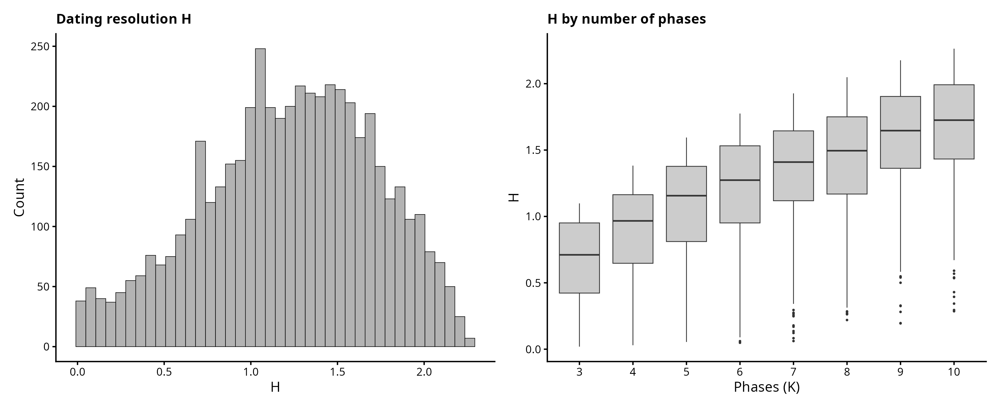
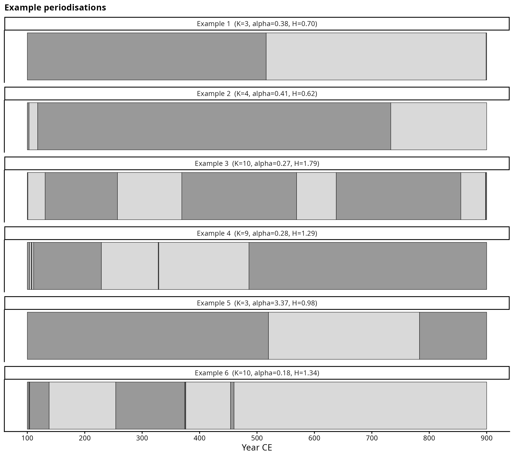
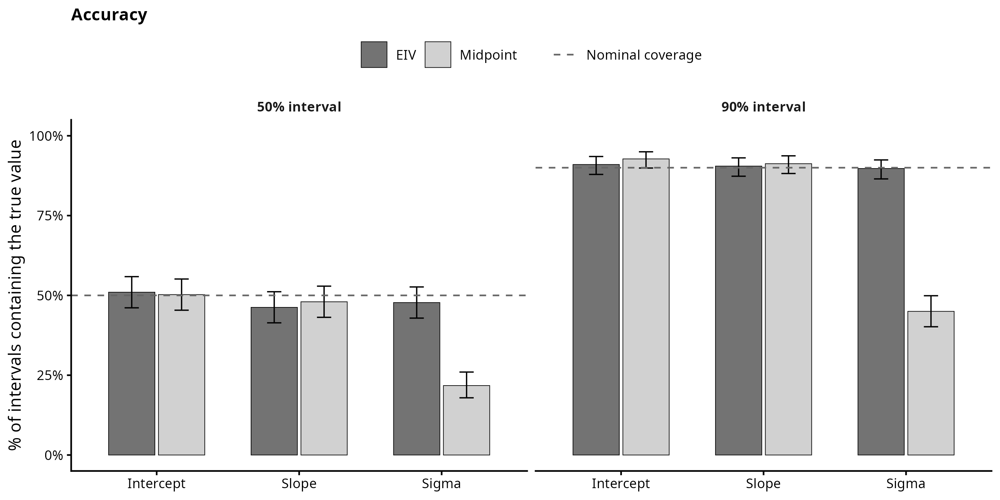
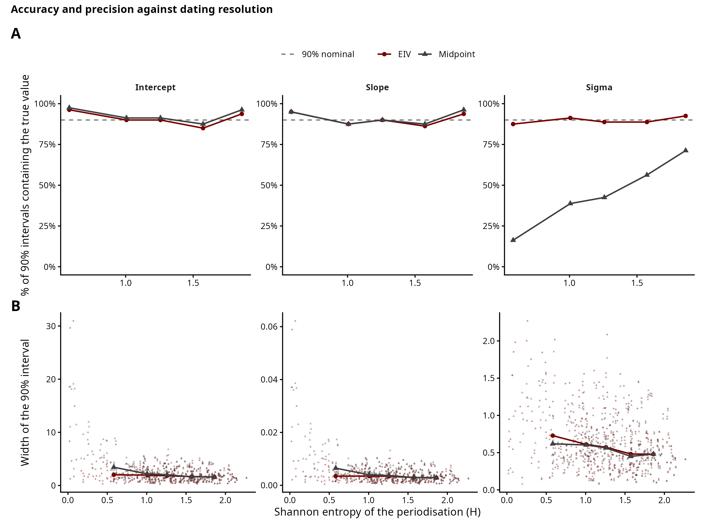
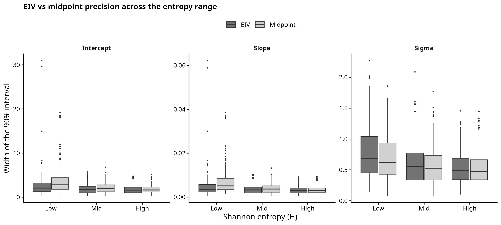
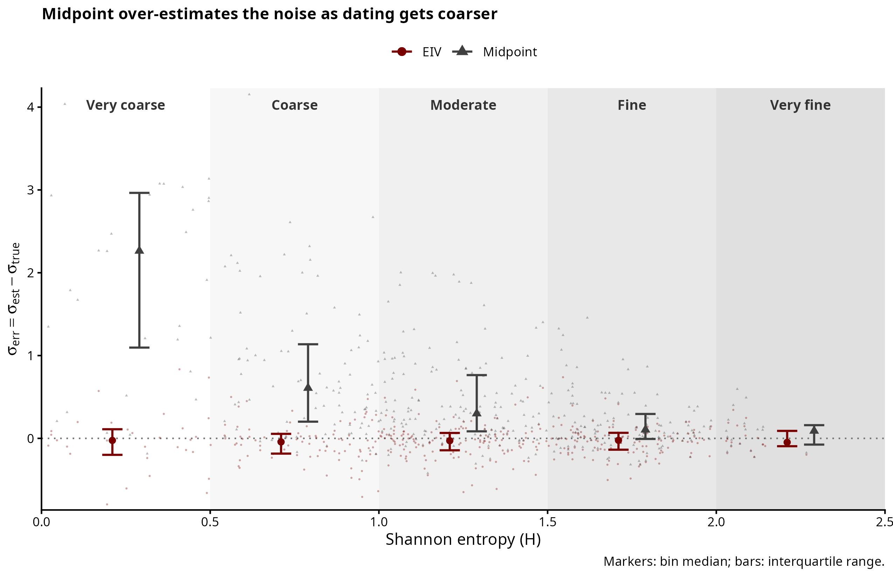
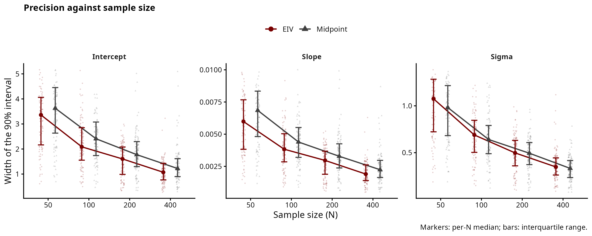

# Simulation 1: Linear Regression

A continuous measurement is assumed to follow a linear temporal trend
`f(t) = baseline + slope * t`, observed with Gaussian noise. Each observation is
dated only to a phase with `[Start_date, End_date]` rather than to a known year. Does treating each date as a latent parameter within its phase recover the trend better than collapsing the phase to its midpoint?

As a single example, we could say that: baseline = 5, slope = 0.015,
noise ~ N(0, 1.5). The timeline is 100–900 CE, periodised into 6 phases.

## Periodisation and dating resolution

We assume that, as common in archaeological relative dating, dates vary in the timeline by phase ("The sample X belongs to phase Y, which has a known duration `[Start_date, End_date]`"). To simulate this we divide the timeline into `K` phases by a Dirichlet broken stick, and every
observation inherits the `[Start_date, End_date]` of the phase its true date
falls in. In this way, observations in the same phase share an identical window and the
dating uncertainty is structured rather than random (as would be the case instead for a radiocarbon date). Each dataset draws its own number of phases (`K ~ U{3, …, 10}`) and Dirichlet concentration
(`alpha_conc = 10^(2·Beta(2, 3.5) − 1)`)[1], which could result either in few even phases or one long phase dominating others in the range. 

The resolution of a periodisation is summarised by the Shannon entropy of the
phase weights, `H = −Σ p · log p`. Even phases have high H (the
ceiling is about 2.3 for ten equal phases), whereas one dominant phase would have instead low H. We also run a
prior-predictive check located in `00_periodisation_check.R`.

*[1] With Beta(2, 3.5) the distribution leans toward low concentrations (coarser, lower-H periodisations). alpha_conc is 10 exponentiated to this Beta so that we get values that are between 0 and 10, but the mass is placed more towards coarser phases.*

<p align="center">


</p>

## Scripts

`simulate.R` contains the shared generating process `simulate_linear()`, the
`partition_timeline()` helper (note to self: might move this to a separate file), and the timeline constants — sourced by the
example and the study so they use the same process.

| Script | Purpose | Output |
|---|---|---|
| `00_periodisation_check.R` | prior predictive check: draw the priors, simulate datasets, show H, example phases, and the values they imply | `figures/periodisation_H_distribution.png`, `periodisation_examples.png`, `prior_predictive.png` |
| `01_example.R` | one dataset, shown and fit with both models | `figures/exploratory_panel.png`, `model_comparison_single_fit.png`, `individual_date_posteriors.png` |
| `02_recovery_study.R` | many random datasets (each its own intercept, slope, noise, sample size, periodisation), both models fit, intervals recorded | `output/recovery_results.csv` |
| `03_recovery_plots.R` | the study figures | `figures/recovery.png`, `accuracy.png`, `accuracy_precision_composite.png`, `precision_vs_entropy.png`, `sigma_vs_entropy.png`, `accuracy_vs_entropy.png`, `precision_boxplots.png`, `precision_vs_n.png` |

The example (`01`) fits in less than a minute; the study (`02`) takes a few minutes (around 10 circa), so
plotting (`03`) is kept separate and figures can be restyled without refitting.
Sample size is swept across `N = 50, 100, 200, 400` to read precision against N.

## Exploratory panel
This is a single example that is used as a figure in the paper to illustrate the data generating process.
<p align="center">

</p>

## Errors-in-variables (EIV) inference

The EIV model treats each true date as a latent parameter, uniform within its
phase — the regressor is known only to a phase, not to a year:

```
trend(x) = alpha + beta * x
y_n ~ Normal(trend(true_date_n), sigma)
```

Left panels: the recovered trend with a sample's phase (shaded) and value
(dashed). Right panels: each date's posterior, with the phase boundaries (dashed)
and the true date (solid).

<p align="center">

</p>

## Model comparison on one dataset

The midpoint model fixes each date at the centre of its phase. On a single
dataset both recover the trend, but the midpoint returns a larger sigma: the
within-phase date spread it ignores ends up in the residual.

<p align="center">

</p>

## Recovery study

The dataset above is just one example for the paper; the real study draws many datasets — each with
its own intercept, slope, noise, sample size, and periodisation. Both models (EIV and midpoint) are
fit to all of them, recording how often the 50% / 90% interval holds the truth
(accuracy) and how wide the interval is (precision).

*Preliminary results*. Both models recover the intercept and slope near the 50% an 90% CIs: for
a straight line the midpoint is the average of the possible dates, so it should not
bias the trend. The EIV intervals for intercept and slope are 12% narrower (more precise), as the midpoint model discards the within-phase spread. 
Sigma also varies: the midpoint reads the within-phase date spread as noise and overestimates it (by simulation design construction?), so its
90% interval contains the true sigma only ~45% of the time against ~90% for EIV. This becomes worse as phases become coarser (~26% at the lowest H, recovering toward ~66% as they
become finer). As expected, the precision improves with sample size for both models.

<p align="center">

</p>

<p align="center">

</p>

Overall calibration. For each parameter, the number of datasets whose 50% and 90%
interval (dashed line) actually held the true value. The whiskers are 95% Jeffreys intervals.

### Accuracy and precision against dating resolution

These plots show if an interval is accurate (does the 90% interval hold the truth?) and precise (width of the 90% interval). Panel A shows the accuracy and panel B shows the precision, both across the entropy range.


<p align="center">

</p>

Again, no much difference between the two models for the intercept and slope, what changes is sigma. For coarser phases, sigma is better captured by the EIV model: 

<p align="center">


</p>


### Further checks: Sample size

We also check how sample size affects the precision: both models show a steady improvement in precision as sample size increases. 

<p align="center">

</p>
