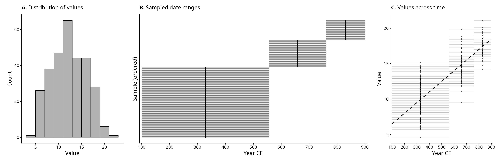
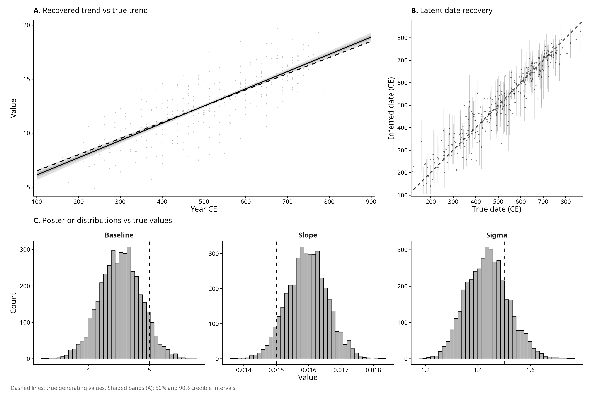
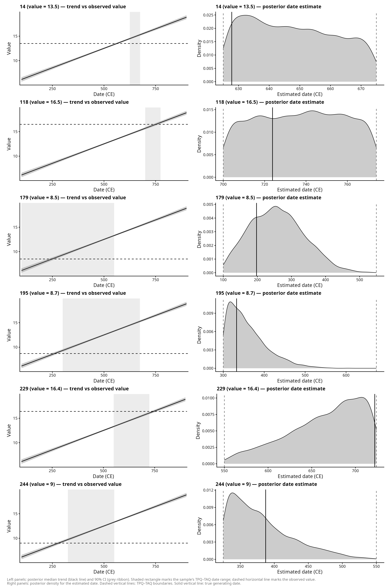
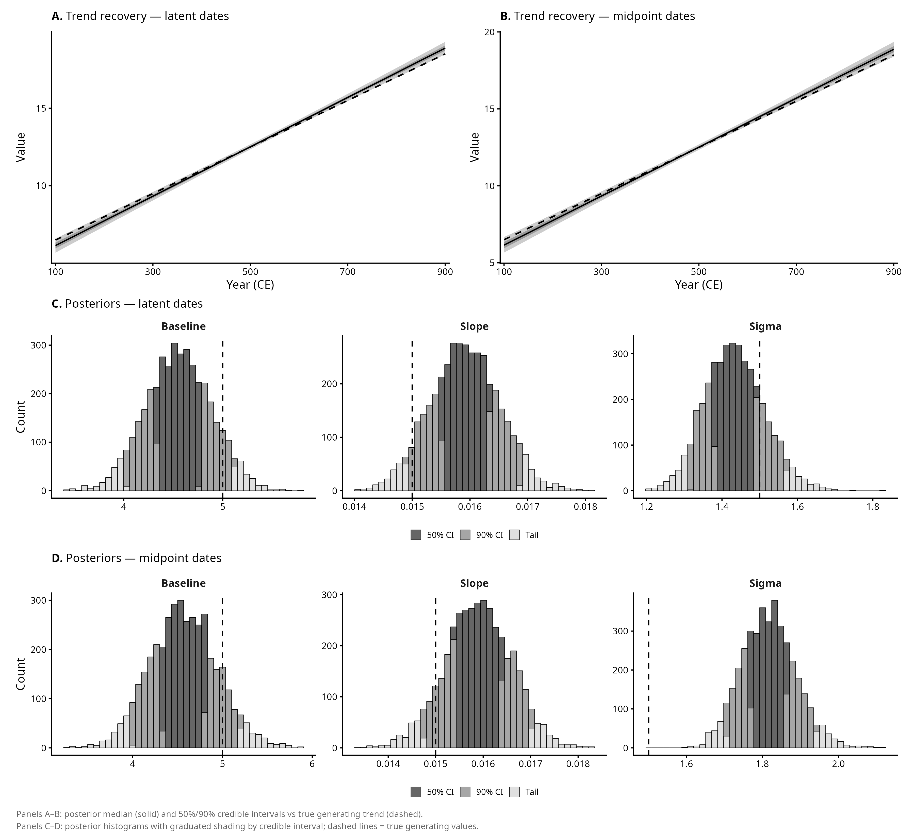

# Simulation 1: Linear Regression

This page shows the main findings from the simulated dataset of 300 samples of a continuous variable ranging approximately between ~5 and ~20 (Figure A). Each sample is assigned a time range with a `Start_Date` and an `End_Date`, with a known true date assigned between these boundaries (Figure B). 
The general structure of the dataset assumes an underlying linear temporal trend (Figure C):
`f(t) = baseline + slope * t`

Given the simulated nature of the dataset, the goal is to verify that the model recovers the known generating parameters:

- **Baseline** = 5
- **Slope** = 0.015
- **Noise** ~ N(0, 1.5)

## Exploratory panel
<p align="center">

</p>

## Model 1: Linear regression

A standard Bayesian linear regression with latent date inference. Each observation's true date is modelled as a uniform draw within its `[Start_date, End_date]` window, and the trend is a simple linear function:

```
trend(x) = alpha + beta * x
y_n ~ Normal(trend(true_date_n), sigma)
```

Panel **A** shows the recovered trend (median and 50%/90% credible intervals) against the true generating function; the rug on the right margin shows the distribution of observed values. Panel **B** is a date recovery plot: each dot is one sample, with the true generating date on the x-axis and the posterior median date on the y-axis — if recovery were perfect, all points would sit on the dashed 1:1 line; vertical bars show the 90% CI. Panel **C** shows posterior distributions for each generating parameter, with graduated shading by credible interval and dashed lines marking the true values.

<p align="center">

</p>

## Individual sample diagnostics

Per-sample diagnostic panels for a random subset of observations. The left panel shows the posterior trend (median and 90% CI) with the sample's observed value (dashed horizontal line) and TPQ–TAQ date range (shaded rectangle). The right panel shows the posterior density for the estimated date, with dashed vertical lines for the TPQ–TAQ boundaries and a solid vertical line for the true generating date.

<p align="center">

</p>

## Model comparison: latent dates vs midpoint dates

A second model uses the midpoint of each sample's `[Start_date, End_date]` window as a fixed date, with no latent date inference. This is the conventional approach — treating the midpoint as the "best guess" and ignoring date uncertainty.

Panels **A–B** compare the trend recovery of the latent-date model and the midpoint model. Panels **C–D** show the posterior distributions for each generating parameter, with graduated shading by credible interval (50% CI darker, 90% CI lighter, tails lightest). The midpoint model produces wider posteriors and a sigma estimate biased upward (~1.7 vs the true 1.5), because unmodelled date uncertainty is absorbed into the residual variance.

<p align="center">

</p>
