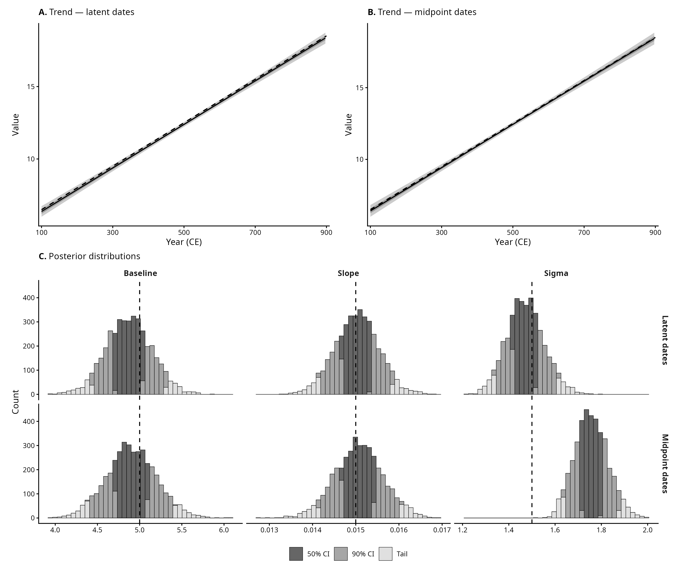
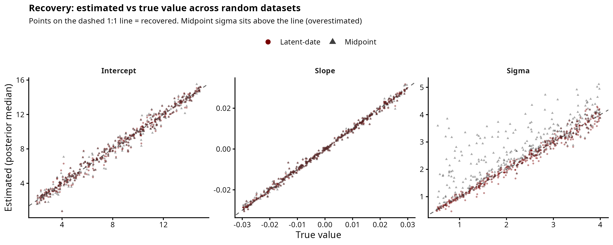
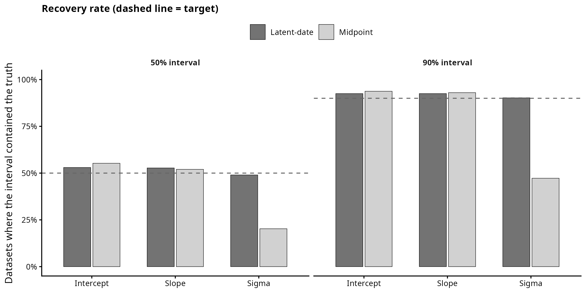
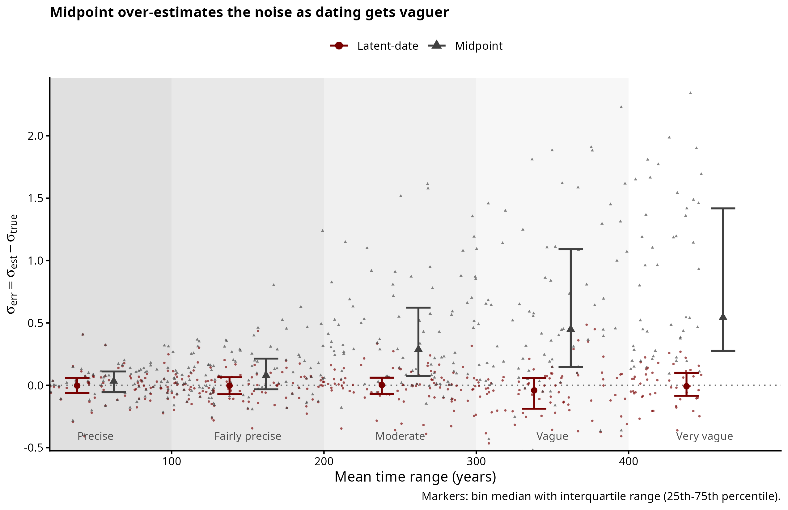

# Simulation 1: Linear Regression

A continuous measurement is assumed to follow a linear temporal trend
`f(t) = baseline + slope * t`, observed with Gaussian noise. Each observation
carries a dating range `[Start_date, End_date]` (of varying width) rather than a
known year. The question is whether treating each date as a latent parameter
within its range recovers the trend better than collapsing the range to its
midpoint.

Generating parameters: **baseline = 5**, **slope = 0.015**, **noise ~ N(0, 1.5)**.

## Scripts

`simulate.R` holds the shared generating process (the `simulate_linear()`
function and constants); it is sourced by both the worked example and the study,
so the two provably use the same process. The pipeline is then three scripts:

| Script | Purpose | Output |
|---|---|---|
| `01_example.R` | draw ONE dataset, show it, fit both models, compare | `figures/exploratory_panel.png`, `model_comparison_single_fit.png`, `individual_date_posteriors.png` |
| `02_recovery_study.R` | draw MANY random plausible datasets (each with its own intercept, slope, noise, sample size, mixed windows), fit both models, record whether each interval contains the truth | `output/recovery_results.csv` |
| `03_recovery_plots.R` | the study figures | `figures/recovery.png`, `coverage.png`, `sigma_vs_window.png` |

The worked example (`01`) fits in seconds, so it is self-contained. The study
(`02`) takes minutes, so its plotting (`03`) is kept separate — figures can be
restyled without refitting.

## Exploratory panel
<p align="center">

</p>

## Latent-date inference

The latent-date model treats each observation's true date as an unknown parameter,
uniform within its `[Start_date, End_date]` window:

```
trend(x) = alpha + beta * x
y_n ~ Normal(trend(true_date_n), sigma)
```

For a sample of observations, the left panels show the recovered trend with the
sample's date range (shaded) and observed value (dashed); the right panels show
the posterior for each estimated date, with the range boundaries (dashed) and the
true generating date (solid).

<p align="center">

</p>

## Model comparison on a single dataset

The midpoint model fixes each date at the midpoint of its range. On one dataset
both approaches recover the trend within the 90% credible interval, but the
midpoint model returns a larger sigma, because unmodelled date uncertainty is
absorbed into the residual variance.

<p align="center">

</p>

## Recovery study

A single dataset tests the method at one point and cannot rule out a favourable
choice of parameters. Instead the study simulates many random plausible datasets:
each draws its own intercept, slope, noise level, sample size, and a realistic mix
of dating-window widths. Both models are fit to every dataset, and we count how
often each 50% / 90% credible interval contains the true value.

**Findings.** Both models recover the intercept and the slope at close to the
nominal rates — for a linear trend the midpoint is the average of the possible
true dates, so it does not bias the trend. The two diverge on the noise level
sigma: the midpoint absorbs dating uncertainty into the residual and overestimates
sigma, and the error grows as a dataset's dating becomes vaguer. The latent-date
model recovers sigma whatever the dating precision, so it is never worse than the
midpoint and substantially better when dates are uncertain.

<p align="center">



</p>
