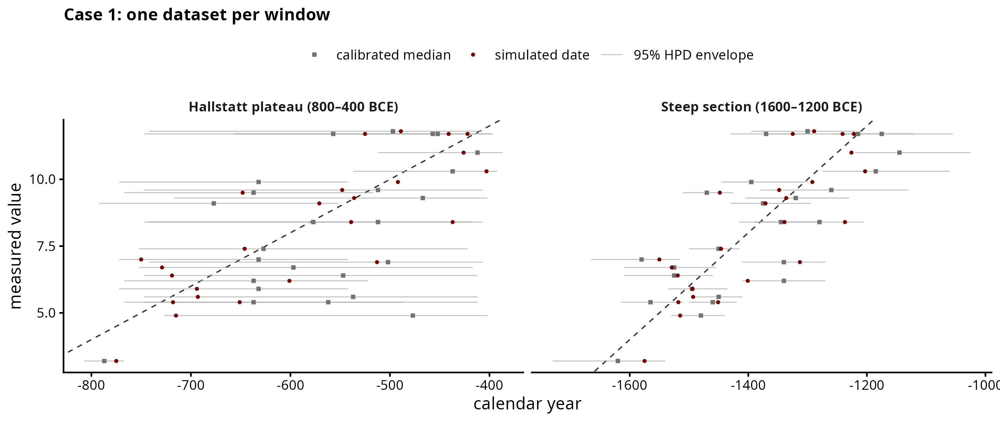
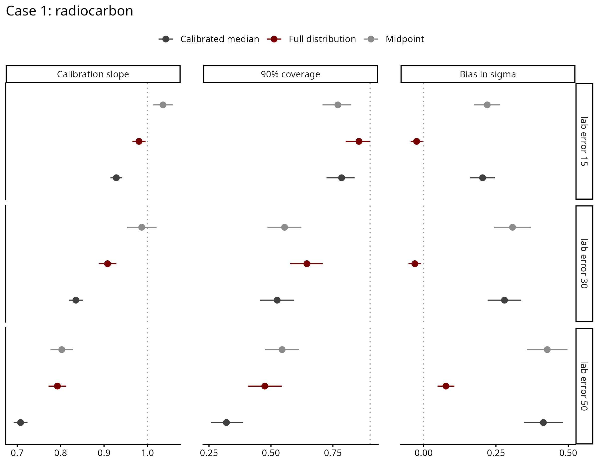
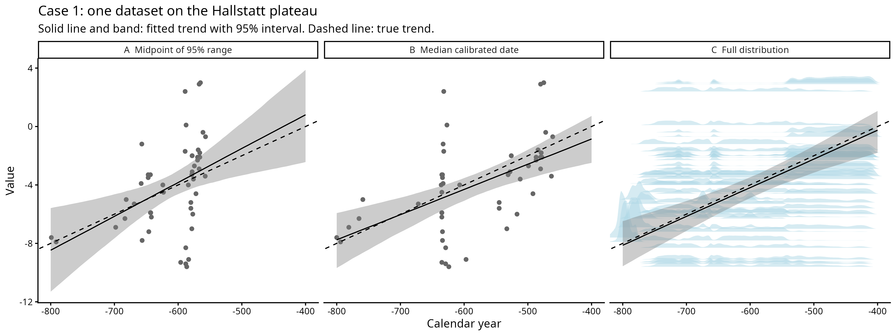
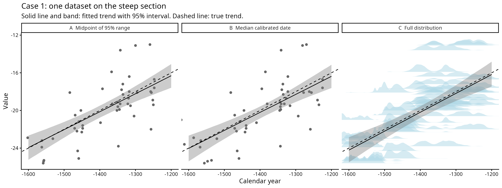

# Case 1 — Radiocarbon

## The archaeological case

This is the case of samples dated by radiocarbon. Each sample has a measured
value and a calibrated date, which is a probability distribution over calendar
years. Unlike the other cases, the date is not a range known to contain the true
date: it is peaked, often has several peaks, and comes from a noisy measurement.

We test whether the trend can be recovered from calibrated dates, and whether a
model given the full calibrated distribution performs better than models that use
the midpoint of the 95% range or the calibrated median. This is the only case
where midpoint and median are different numbers.

## How the data is generated

For each sample, in `shared/dating/case1_radiocarbon.R`:

1. A true date in the study window. Evenly spread, or denser towards the end
   (`growth_ratio`).
2. A radiocarbon age: the IntCal20 value at that date plus noise. The noise
   combines the lab error and the error of the curve itself (about 12-16 yr in
   these windows), because `rcarbon::calibrate()` assumes both.
3. A measured value, `intercept + slope * true date + noise`.

Two windows of 400 yr:

| Window | Mean 95% range | Median vs midpoint |
|---|---|---|
| 800-400 BCE, Hallstatt plateau | 223 yr | 45 yr apart on average, 98 max |
| 1600-1200 BCE, steep section | 147 yr | 9 yr apart on average, 25 max |

On the plateau calibrated dates are wide and a single date can have its 95% range
split in four. On the steep section they are narrow and have one peak.

The design (`scripts/01_design.R`), 100 datasets per setting, 1600 in total:

| Sweep | Varies |
|---|---|
| core | dataset size 50, 100, 200, 500; slope random or zero; on the plateau |
| factor | lab error 15, 30, 50 crossed with window; N = 200 |
| deposition | samples 4 times denser at the end, both windows |

Limitation: curve error is drawn independently for each date. In reality one
IntCal20 error moves neighbouring dates together, and no model here can absorb that.

## Feeding the models

Dates are calibrated with `rcarbon::calibrate()`, once per dataset, and all three
fits see the same calibrated dates. All three use the same model
(`shared/models/linear_dates.stan`).

The midpoint model uses the centre of the 95% range (on average the range keeps
97.5% of the calibrated probability). The median model uses the calibrated median.
The full-distribution model gets the whole calibrated distribution on a 5-year
grid, gaps between peaks included.

`rcarbon` calibrates with a flat prior over the whole calibration curve, so the
model is not told the study window. The grid is padded by 588 yr on each side (the
widest calibrated date over both windows and all lab errors) so no date is cut.

## Results

Recovery study rerun on 2026-10-01 with the shared model (it matches the
2026-09-08 run within sampling noise), uniform deposition only. The plateau column pools
the dataset size sweep (lab error 30, N 50 to 500, including datasets with no
true slope) with the lab error sweep (N 200, lab error 15, 30 and 50). The steep
column is the lab error sweep only. On the lab error sweep alone the plateau
slope ratios are 1.06, 0.82 and 0.95 (second table below), so the comparison
holds on matched datasets.

| Model | Plateau: slope ratio | coverage | σ bias | Steep: slope ratio | coverage | σ bias |
|---|---|---|---|---|---|---|
| Midpoint | 1.11 | 0.82 | +0.28 | 0.80 | 0.43 | +0.14 |
| Calibrated median | 0.82 | 0.72 | +0.26 | 0.82 | 0.47 | +0.14 |
| Full distribution | 0.96 | 0.84 | -0.03 | 0.83 | 0.49 | +0.01 |

On the plateau the three models separate. The full-distribution model recovers the
slope and sigma, the midpoint steepens the slope and the median flattens it. No
model reaches 0.90 coverage.

Slope bias (mean error) is close to zero for every model, because true slopes lie
on both sides of zero and flattening or steepening cancels out. That is why the
slope ratio is reported. In typical error (RMSE, in 10⁻³ per year) the
full-distribution model is best on the plateau: 3.47, against 3.87 for the median
and 4.93 for the midpoint. Its 90% intervals are slightly wider than the median
model's (8.05 against 7.75), which is what brings its coverage closer to 0.90. On
the steep section the three models barely differ (RMSE 3.60-3.97).

On the steep section all three flatten the slope. Each calibrated date spreads
past the edges of where the samples really are, nothing ties the dates together,
so the dates look more spread out than they are and the slope flattens.
`scripts/diagnostics/` tests this (steep section, 120 datasets per setting):

| Condition | Lab error 15: slope ratio | coverage | Lab error 50: slope ratio | coverage |
|---|---|---|---|---|
| true dates | 1.01 | 0.88 | 1.01 | 0.92 |
| full distribution, as in the study | 0.94 | 0.73 | 0.73 | 0.23 |
| study window given | 1.02 | 0.88 | 1.01 | 0.90 |
| date distribution estimated, single normal | 1.02 | 0.86 | 1.01 | 0.92 |

The last two rows are diagnostics, not the result. "Study window given" cuts
each date at the true window edges, which uses information a real analyst does
not have. "Date distribution estimated" gives the dates a shared distribution
whose shape is learnt from the data, and never sees the window. In this run
(`06_`, 9 Sep) that distribution was a single normal curve. Both remove the
flattening on the steep section, which confirms that the spread past the edges
is what causes it.

The model is not told the study period, since the period is an inclusion
criterion (supervisor, 2026-09-22, `Notes/supervisor_questions_2026-09-17.md`),
so the flattening on the steep section stands as a result and is reported as a
limitation. Whether estimating a distribution for the dates is acceptable is
still to ask.

The single normal came out too narrow on the plateau, so it was replaced by a
free shape made of 40 fixed bumps whose weights are estimated
(`shared/models/marginal_date_period.stan`). Rerun on the whole design (`07_`,
28 Sep). The table compares the two windows on the same datasets, the lab error
sweep (N 200, lab error 15, 30 and 50, 300 datasets per window), since the
plateau alone also has the dataset size and zero-slope sweeps. It fixes the
steep section but steepens the plateau:

| Model | Plateau: slope ratio | coverage | Steep: slope ratio | coverage |
|---|---|---|---|---|
| midpoint | 1.07 | 0.81 | 0.80 | 0.43 |
| calibrated median | 0.82 | 0.61 | 0.82 | 0.47 |
| full distribution, as in the study | 0.95 | 0.84 | 0.83 | 0.49 |
| date distribution estimated, 40 bumps | 1.14 | 0.84 | 1.00 | 0.90 |

The single normal gave 1.32 on the plateau on the same datasets, so the free
shape halves the overcorrection but does not remove it. The estimated
distribution is probably still too narrow on the plateau, squeezing the dates
together (not checked, the run did not save it). It does not make up trends: with a true slope of zero, 13%
of datasets exclude zero against 14% for the full distribution. It is slow (79
hours for the full design). Results in `output/diagnostics/period_full/`.

Four times denser deposition at the end changes nothing we can detect with 100
datasets per setting. With no real trend, the 90% interval excludes zero in 13%
(midpoint), 14% (median) and 13% (full distribution) of datasets, against 10%
expected.

### Side tests

Three quick tests from the meeting of 18 Sep, on single datasets (details in
`Notes/`):

- Reversed (`08_`): the date as the response of a value known exactly, following
  Crema's measurement_error_example.R. On the plateau the regression on median
  calibrated dates halves the slope (0.14 against a true 0.27), the Nimble model
  with the full calibrated dates gets 0.24.
- One date fixed to a constant (`09_`): replacing one sample's calibrated date
  with a single year changes the total log likelihood by about that sample's
  term alone. A wrong year moves the slope by about two thirds of its posterior
  SD and raises sigma.
- Which kind of error a calibrated date carries (`10_`, no model fitted): on the
  steep section calibrated dates are more spread out than the true dates
  (classical-like), on the plateau they are squeezed together (Berkson-like).
  Spreading hurts when the date is the predictor, squeezing hurts when it is the
  response. The expected slope ratios reproduce the fitted ones (0.83 steep,
  1.11 plateau midpoint, 0.51 reversed).

## Figures

| File | Shows |
|---|---|
| `figures/dataset_anatomy.png` | one dataset per window, before any fitting |
| `figures/single_fit_comparison.png` | one dataset on the plateau, fitted on midpoints, calibrated medians and the full calibrated distributions (drawn in panel C) |
| `figures/single_fit_comparison_steep.png` | the same for the steep section |
| `figures/recovery_summary.png` | headline result across all datasets |
| `figures/recovery_by_lab_error.png` | recovery by lab error and window |
| `figures/checks/` | calibrated dates overview, dataset size, deposition |

## Files

Run in order: `01` → `03` → `04`, then `02` and `05`.

| File | What it does |
|---|---|
| `shared/dating/case1_radiocarbon.R` | draws true dates and turns each into a radiocarbon age |
| `scripts/01_design.R` | builds the list of datasets to simulate, `data/design.csv` |
| `scripts/02_figures.R` | `dataset_anatomy.png` and `checks/overview.png` |
| `scripts/03_recovery_study.R` | calibrates each dataset and fits the three methods; about 4.5 h on 24 workers |
| `scripts/04_recovery_plots.R` | `output/recovery_metrics.csv` and the figures |
| `scripts/05_single_fit.R` | `single_fit_comparison.png` and `single_fit_comparison_steep.png` |
| `scripts/checks/00_check_rows.R` | calibrated weight rows give the same medians as `rcarbon` |
| `scripts/checks/00_check_fit.R` | simulate, calibrate and fit one dataset |
| `scripts/diagnostics/` | why the steep section flattens the slope (`05_`), estimating a distribution for the dates (`06_`, `07_`), the reversed test (`08_`), fixing one date to a constant (`09_`), which kind of error a calibrated date carries (`10_`) |

Older runs are in `output/archive/`, diagnostic results in `output/diagnostics/`.
